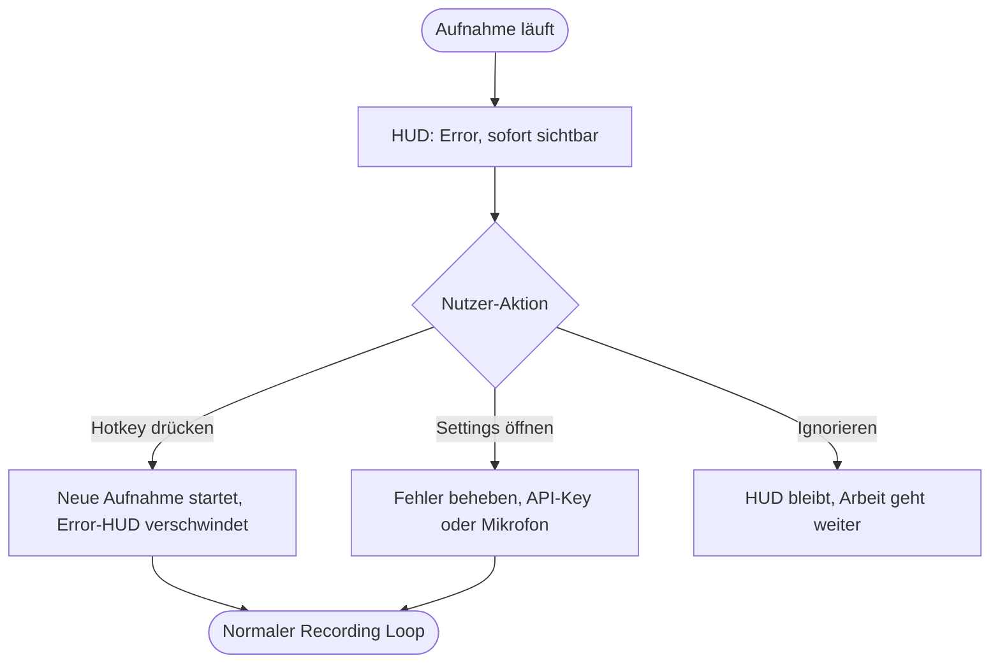

# UX Design Specification agent-flow

**Author:** Yoda
**Date:** 2026-02-21

---

<!-- UX design content will be appended sequentially through collaborative workflow steps -->

## Executive Summary

### Project Vision

WhisperFlow ist eine unsichtbare Desktop-App (Electron, macOS-first), die Voice-to-Text-Transkription als erstklassigen Input-Kanal in den Entwickler-Workflow integriert. Die App läuft im System Tray, wird über globale Shortcuts aktiviert und liefert Transkriptionsergebnisse direkt in die Zwischenablage — ohne Kontextwechsel, ohne UI-Overhead. Der Kernmoment: Shortcut drücken → sprechen → loslassen → Text ist nutzbar.

Differenzierer: **Frictionless Availability** — WhisperFlow ist immer verfügbar wie eine Tastenkombination und verschwindet nach getaner Arbeit.

### Target Users

**Primär: Softwareentwickler (macOS)**
- Technisch versiert, keyboard-driven, erwartet native macOS-Qualität
- Nutzt Voice für Diktate: Commit-Messages, PR-Beschreibungen, Tickets, Slack-Nachrichten, Dokumentation
- Nutzt Voice für Transkription: Meetings, Calls, Videos
- Frustriert von: Kontextwechsel, inakzeptabler Latenz, unzureichender Qualität für technische Inhalte
- Erwartet: Tool verhält sich wie OS-native Feature — zuverlässig, schnell, immer verfügbar

### Key Design Challenges

1. **Unsichtbarkeit vs. Feedback**: Die App soll im Hintergrund verschwinden — aber der Nutzer braucht klares Feedback über Recording-Status, API-Verarbeitung und Ergebnis. Balance zwischen Minimal-UI und ausreichend Orientierung ist die zentrale UX-Herausforderung.
2. **Onboarding-Hürde**: Nutzer müssen FFmpeg installieren und einen Whisper API-Key einrichten bevor sie den ersten Mehrwert erleben. Dieser technische Setup muss frictionless, motivierend und fehlerresistent gestaltet sein.
3. **Fehler-Kommunikation im Kontext**: Fehler (API-Fehler, FFmpeg nicht gefunden, schlechte Aufnahme) passieren während der Nutzer in einer anderen App arbeitet. Nicht-invasive aber wirksame Fehler-Kommunikation ohne Unterbrechung des Workflows.

### Design Opportunities

1. **HUD als Signature-Moment**: Das kurze Feedback-Fenster (Recording → Transcribing → Done) ist die einzige UI, die Nutzer regelmäßig sehen. Es kann ein Qualitäts-Statement sein — präzise, schnell, satisfying. Dieser Moment kann WhisperFlow von anderen Tools differenzieren.
2. **Shortcut-Erlebnis als Produktmoment**: Der Übergang von "Ich drücke Shortcut und spreche" zu "Text ist in der Zwischenablage" kann sich wie Magie anfühlen — dieser Flow muss mit höchster UX-Sorgfalt gestaltet werden.
3. **Progressive Disclosure im Onboarding**: Technische Komplexität (FFmpeg, API-Key, BlackHole) schrittweise einführen. Nutzer soll so früh wie möglich den "Aha-Moment" erleben, bevor alle Abhängigkeiten konfiguriert sind.

## Core User Experience

### Defining Experience

Der Kern-Loop ist: Shortcut halten → sprechen → loslassen → Text in der Zwischenablage.
Der kritische UX-Moment liegt im Zwischenraum: Die Qualität des Feedbacks während
Recording und Transcribing entscheidet darüber, ob Nutzer dem System vertrauen.
WhisperFlow muss in jedem State klar kommunizieren, was gerade passiert —
ohne Ablenkung, ohne Interaktion zu erfordern.

### Platform Strategy

- Primär: macOS Desktop, vollständig keyboard-driven
- Kein Maus-Klick im Core-Flow erforderlich
- Globaler Shortcut funktioniert unabhängig von der fokussierten App
- App verhält sich wie ein OS-natives Feature, nicht wie eine Applikation

### Effortless Interactions

- Shortcut-Aktivierung: sofortige visuelle Reaktion, kein spürbarer Delay
- **Audio-Pegel-Visualisierung (Echtzeit)**: Nutzer sieht den Ausschlag von Mikrofon
  oder System-Audio live im HUD — visueller Beweis, dass die Aufnahme läuft und
  Ton ankommt. Ohne dieses Feedback fehlt die Gewissheit, dass überhaupt etwas
  aufgenommen wird.
- State-Wechsel Recording → Transcribing → Done: klar, lesbar, kein Rätselraten
- Clipboard-Output: Text ist nach Done sofort verfügbar, kein weiterer Schritt

### Critical Success Moments

- **Erster Test im Onboarding**: Nutzer spricht und sieht den Pegel im HUD ausschlagen —
  das ist der Aha-Moment, der den Wert beweist
- **State-Wechsel zu "Transcribing"**: Nutzer lässt Shortcut los und sieht sofort
  Feedback — kein Dead-Air, kein Unsicherheitsgefühl
- **"Success"-State**: Text ist da — dieser Moment muss satisfying sein

### Experience Principles

1. **Vertrauen durch Sichtbarkeit**: Jeder State ist klar kommuniziert — der
   Echtzeit-Pegel ist der wichtigste Vertrauensanker während der Aufnahme
2. **Null Interaktion im Core-Flow**: HUD ist passiv, kein Klick, kein Hover —
   der Nutzer bleibt in seiner primären App
3. **Keyboard-first, always**: Kein Feature des Core-Flows erfordert eine Maus
4. **Feedback ist das Produkt**: Die App ist unsichtbar — aber ihr Feedback-Layer
   ist das einzige, was Nutzer je sehen, und muss daher exzellent sein.

## Desired Emotional Response

### Primary Emotional Goals

WhisperFlow soll sich anfühlen wie ein erstklassiges macOS-Native-Tool —
modern, präzise, professionell. Nutzer sollen das Gefühl haben, ein
Werkzeug zu benutzen, das von jemandem gebaut wurde, der ihren Workflow versteht.

- **Vertrauen**: "Das funktioniert — immer."
- **Effizienz**: "Das geht schneller als ich dachte."
- **Kontrolle**: "Ich weiß jederzeit, was passiert."

### Emotional Journey Mapping

| Phase | Gewünschte Emotion | Zu vermeiden |
|---|---|---|
| Shortcut drücken | Sofortige Bestätigung, Sicherheit | Unsicherheit ob es losging |
| Während der Aufnahme (Pegel sichtbar) | Vertrauen, Fokus | Zweifel, Ablenkung |
| State-Wechsel zu Transcribing | Entspannung, Erwartung | Dead-Air, Angst |
| Success-State | Satisfying Abschluss, Zufriedenheit | Anticlimactic |
| Fehlerfall | Klarheit, Handlungsfähigkeit | Frustration, Ratlosigkeit |

### Micro-Emotions

- **Confidence** über Skepticism: Nutzer vertraut dem System nach wenigen
  erfolgreichen Nutzungen blind
- **Accomplishment** über Frustration: Jeder erfolgreiche Shortcut-zu-Text-Loop
  fühlt sich wie ein kleiner Sieg an
- **Calm Focus** über Anxiety: Der Pegel-Indikator nimmt die Unsicherheit
  während der Aufnahme vollständig weg

### Design Implications

- **Modern Professional, kein Spielzeug**: Farbpalette dunkel/neutral mit
  präzisen Akzentfarben — kein buntes UI, kein Gradient-Overkill
- **Animationen als Qualitätssignal**: Subtile, schnelle Transitions zwischen
  HUD-States (Recording → Transcribing → Done) kommunizieren Präzision,
  nicht Verspieltheit. Denk Raycast, Linear — nicht Duolingo.
- **Fehler menschlich, aber knapp**: "API-Key ungültig — Einstellungen öffnen"
  statt "Error 401". Klar, handlungsorientiert, kein technischer Dump.
- **Pegel-Animation**: Smooth, reaktiv, präzise — kein pixeliges Balken-Widget,
  sondern eine saubere Wellenform oder Bars die auf die Stimme reagieren

### Emotional Design Principles

1. **Professionell ≠ Langweilig**: Animationen sind erlaubt und gewünscht —
   sie müssen aber Zweck und Qualität kommunizieren, nicht Aufmerksamkeit fordern
2. **Jeden Fehler entwaffnen**: Fehlerzustände fühlen sich nie wie eine Sackgasse
   an — immer mit klarem nächsten Schritt
3. **Satisfying Completion**: Der Success-State ist der emotionale Höhepunkt
   jeder Nutzung — er verdient besondere Sorgfalt in Animation und Feedback
4. **Unsichtbar bis gebraucht, exzellent wenn sichtbar**: Wenn das HUD erscheint,
   muss es das beste kurze UI-Erlebnis des Tages sein

## UX Pattern Analysis & Inspiration

### Inspiring Products Analysis

**Raycast**
- Keyboard-first, erscheint on-demand und verschwindet ohne Spur
- Blitzschnelle Reaktionszeit — keine wahrnehmbare Latenz nach Shortcut
- Animationen sind präzise und minimal, kommunizieren Qualität ohne abzulenken
- Fehler-Handling klar und handlungsorientiert
- *Relevanz für WhisperFlow*: Der gesamte Interaction-Ansatz — App als OS-Extension, nicht als eigenständige Anwendung

**Linear**
- Dark-mode-first, hochpräzises visuelles Design ohne Verspieltheit
- Jede Interaktion fühlt sich durchdacht an — kein Feature wirkt angeheftet
- Subtile Micro-Animationen die Zustandsänderungen kommunizieren
- *Relevanz für WhisperFlow*: Visuelles Qualitätsniveau und Ton für dark-mode HUD-Design

**macOS Native UI-Conventions (Spotlight, Notification Center)**
- Passives Overlay-Verhalten — erscheint, informiert, verschwindet
- System-integriertes Look & Feel schafft sofortiges Vertrauen
- *Relevanz für WhisperFlow*: HUD-Verhalten und Positionierung

### Transferable UX Patterns

**Overlay/HUD-Patterns:**
- Zentriertes oder Ecken-positioniertes Overlay mit definiertem Z-Index über allem
- Auto-dismiss nach Success mit kurzer Verzögerung (1–2 Sek.)
- Smooth fade-in/out — nie abruptes Erscheinen oder Verschwinden

**Audio-Feedback-Patterns:**
- Echtzeit-Pegel als animierte Bars oder Wellenform (vertikal reagierend auf Amplitude)
- Visueller Unterschied zwischen "Stille erkannt" und "Aktive Aufnahme"
- Timer-Anzeige während Recording für Orientierung

**State-Transition-Patterns:**
- Klare visuelle Unterscheidung zwischen Recording (aktiv/rot) → Transcribing (neutral/spinner) → Done (grün/check)
- Transition-Animationen zwischen States: 150–200ms ease-out

### Anti-Patterns to Avoid

- **Modal-Blocker**: HUD darf nie die Arbeit in der primären App unterbrechen oder blockieren
- **Information Overload**: HUD zeigt nur den aktuellen State — keine Metriken, keine Buttons, kein Text-Preview
- **Blink-Animationen**: Kein Blinken für Aufmerksamkeit — zu aggressiv für ein Hintergrund-Tool
- **Lange Onboarding-Flows**: Kein mehrseitiger Wizard vor dem ersten Mehrwert-Erlebnis
- **Technische Fehlermeldungen**: Kein Raw-Error-Text im HUD — immer übersetzt in Nutzersprache

### Design Inspiration Strategy

**Übernehmen:**
- Raycast's Keyboard-first-Philosophie: WhisperFlow ist ein OS-Feature, keine App
- Linear's dunkles, präzises visuelles System als Vorbild für Farbpalette und Typografie

**Adaptieren:**
- Spotlight's Overlay-Positionierung: angepasst für persistente State-Anzeige statt Input-Feld
- Raycast's Animations-Timing: auf Audio-Feedback-Kontext angepasst (reaktiver, lebendiger)

**Vermeiden:**
- Jede Form von Gamification oder "Achievement"-Feedback
- Bunte Farbpaletten oder illustrative Elemente
- Interaktive Elemente im HUD-Overlay

## Design System Foundation

### Design System Choice

**Radix UI + Tailwind CSS** mit Dark-mode-first als Basis.

Radix UI liefert vollständig headless, zugängliche Primitives ohne visuelles Opinionating —
jede Komponente ist vollständig anpassbar. Tailwind CSS übernimmt das Styling-System.
Animationen via `framer-motion` für HUD-Transitions.

### Rationale for Selection

- **Headless Primitives**: Radix UI gibt keine visuelle Meinung vor — WhisperFlow
  sieht aus wie WhisperFlow, nicht wie ein Framework
- **Accessibility first**: ARIA-Patterns, Keyboard-Navigation und Focus-Management
  sind eingebaut — kein manueller Aufwand
- **Dark-mode-first**: Tailwind's dark-mode-Support macht dies zur Standardkonfiguration,
  nicht zum Nachgedanken
- **Electron-kompatibel**: Kein Browser-spezifisches Overhead, kleine Bundle-Size
- **Professioneller Ästhetik**: Ohne Framework-Gesicht — passt zur Raycast/Linear-Referenzästhetik

### Implementation Approach

- `@radix-ui/react-*` Primitives für Basis-Komponenten (Dialog, Tooltip, Popover, etc.)
- Tailwind CSS für alle Styles mit custom Design Tokens
- `framer-motion` für HUD-State-Transitions und Audio-Pegel-Animationen
- CSS Custom Properties für Farb-Theme-Variablen (dark als default, light optional)

### Customization Strategy

- **Design Tokens**: Farbpalette, Spacing, Typografie als Tailwind-Config definiert
- **Component Layer**: Eigene Wrapper-Komponenten über Radix-Primitives mit
  WhisperFlow-spezifischem Styling
- **HUD-Komponenten**: Vollständig custom — kein Radix-Primitive nötig, da
  kein Standard-Pattern passt
- **Theme**: Dark-mode als einziger unterstützter Mode im MVP (light optional später)

## 2. Core User Experience

### 2.1 Defining Experience

WhisperFlow's definierende Erfahrung in einem Satz:
**"Shortcut drücken → sprechen → Shortcut drücken → Text ist in der Zwischenablage."**

Das ist der Satz, den ein Nutzer seinem Kollegen beschreibt. Keine App öffnen,
kein Fenster wechseln, kein Upload — ein zweifacher Tastendruck und der Text ist da.

### 2.2 User Mental Model

Nutzer denken an WhisperFlow wie an eine **Tastenkombination mit Superkraft** —
nicht als App, nicht als Service, sondern als erweiterte OS-Funktion.
Mentales Modell: "Ich drücke Cmd+Shift+Space wie ich Cmd+C drücke — nur spreche ich statt zu tippen."

Existing frustrations mit aktuellen Lösungen:
- Kontextwechsel zu einer dedizierten App unterbricht den Flow
- Unklares Feedback ob die Aufnahme läuft
- Schlechte Qualität für technischen Wortschatz

### 2.3 Success Criteria

- Shortcut-Reaktion: HUD erscheint in < 200ms nach Tastendruck
- Audio-Pegel sichtbar innerhalb der ersten Sekunde der Aufnahme
- State-Wechsel Recording → Transcribing unmittelbar nach zweitem Shortcut
- Success-Animation + auto-dismiss nach ~1,5 Sek. — kein manuelles Schließen nötig
- Text ist in der Zwischenablage bevor das HUD verschwindet

### 2.4 Novel UX Patterns

WhisperFlow kombiniert bekannte Patterns neu:
- **Spotlight-Metapher** (unsichtbar bis gebraucht) + **Recording-Mechanic** (aktiver Prozess)
- Das HUD ist kein Fenster — es ist temporäres Feedback-Overlay ohne Interaktionsfläche
- Keine bekannte App kombiniert diese beiden Patterns auf diese Weise für Voice-Input

### 2.5 Experience Mechanics

**Initiation:**
- Default-Modus: **Toggle** — erster Shortcut startet Recording, zweiter stoppt
- Begründung: Toggle unterstützt sowohl kurze Diktate als auch längere Meeting-Transkriptionen
- Alternativer Push-to-Talk-Modus in Settings wählbar

**Interaction:**
- HUD erscheint sofort am konfigurierten Bildschirmort (konfigurierbar in Settings)
- HUD zeigt: Recording-State-Label + Echtzeit-Audio-Pegel (Bars/Wellenform) + Timer
- Kein Klick, kein Hover, keine Interaktion mit dem HUD während der Aufnahme

**Feedback während Recording:**
- Audio-Pegel-Visualisierung reagiert live auf Mikrofon/System-Audio
- Timer zeigt Aufnahmedauer
- Visueller Unterschied: aktive Stimme vs. Stille erkennbar

**Completion:**
- Zweiter Shortcut → HUD wechselt zu "Transcribing"-State (Spinner/Animation)
- Nach erfolgreicher Transkription: Success-State mit kurzer Animation
- Auto-dismiss nach ~1,5 Sek. — Text ist bereits in der Zwischenablage
- Fehlerfall: Error-State mit kurzem Hinweistext + Action-Link (z.B. "Einstellungen")

## Visual Design Foundation

### Color System

**Palette — Dark-first, Professional:**

| Token | Wert | Verwendung |
|---|---|---|
| `background` | `#0A0A0B` | App-Hintergrund, HUD-Basis |
| `surface` | `#141415` | Karten, Panels, HUD-Container |
| `border` | `#2A2A2D` | Subtile Trenner, Outlines |
| `text-primary` | `#FAFAFA` | Primärer Text, hoher Kontrast |
| `text-muted` | `#8A8A8E` | Labels, sekundäre Beschriftungen |
| `accent` | `#6366F1` | Indigo — Primär-Akzent, interaktive Elemente |
| `recording` | `#EF4444` | Rot — Recording-State, universelles Signal |
| `success` | `#22C55E` | Grün — Success-State, Completion |
| `warning` | `#F59E0B` | Amber — Warnungen, Hinweise |
| `error` | `#EF4444` | Identisch mit recording — konsistentes Rot |

**Semantic Mapping:**
- HUD Recording-State: `recording` (#EF4444) als dominante Farbe
- HUD Transcribing-State: `accent` (#6366F1) + Spinner
- HUD Success-State: `success` (#22C55E) + kurze Animation
- HUD Error-State: `error` + menschlicher Hinweistext

**Accessibility:**
- Alle Text/Hintergrund-Kombinationen erfüllen WCAG AA (Kontrast ≥ 4.5:1)
- `text-primary` auf `background`: ~15:1 — herausragend
- `text-muted` auf `surface`: ~4.6:1 — AA-compliant

### Typography System

| Rolle | Font | Größe | Gewicht | Verwendung |
|---|---|---|---|---|
| HUD State Label | Inter | 13px | 500 | "Recording...", "Transcribing..." |
| HUD Timer | Inter | 12px | 400 | Aufnahmedauer |
| Notification/Snackbar | Inter | 13px | 400 | Kurze System-Meldungen |
| Settings Heading | Inter | 16px | 600 | Abschnitts-Überschriften |
| Settings Body | Inter | 13px | 400 | Erklärungstexte |
| Settings Mono | JetBrains Mono | 12px | 400 | API-Keys, technische Werte |

**Begründung:**
- **Inter**: Hervorragende Lesbarkeit bei kleinen Größen, macOS-nativ ähnlich, modern professional
- **JetBrains Mono**: Für technische Inhalte (API-Keys, Shortcuts) — Entwickler erkennen und schätzen es

### Spacing & Layout Foundation

**Base Unit: 4px**

| Token | Wert | Verwendung |
|---|---|---|
| `space-1` | 4px | Minimaler Innenabstand, Icon-Gap |
| `space-2` | 8px | Kompakte Elemente |
| `space-3` | 12px | Standard-Padding |
| `space-4` | 16px | Sektionstrennung |
| `space-6` | 24px | Große Sektionen |
| `space-8` | 32px | Seitenränder |

**HUD-Dimensionen:**
- Breite: 280px (fix) — kompakt, nicht überwältigend
- Höhe: variabel je State, ~80–96px
- Border-radius: 12px — modern, nicht eckig
- Shadow: `0 8px 32px rgba(0,0,0,0.4)` — hebt sich klar vom Desktop ab

### Accessibility Considerations

- Dark-mode als einziger unterstützter Theme im MVP
- Alle interaktiven Elemente (Settings) haben sichtbaren Focus-Ring (accent-farbe)
- Keyboard-Navigation vollständig unterstützt (Radix UI liefert dies built-in)
- System-Prefer-Reduced-Motion wird respektiert: Animationen werden vereinfacht
- HUD-Text ist immer über WCAG AA Kontrast

## Design Direction Decision

### Design Directions Explored

Vier HUD-Richtungen wurden evaluiert:

| Direction | Form | Größe | Pegel-Feedback |
|---|---|---|---|
| A — Floating Pill | Pill/Kapsel | Kompakt | Bars (vertikal) |
| B — Rounded Card | Karte | Mittel | Volle Wellenform |
| C — Corner Badge | Micro-Pill | Minimal | Mini-Bars |
| D — Spotlight Modal | Breite Card | Groß | Breite Wellenform |

Interaktiver HTML-Showcase: `_bmad-output/planning-artifacts/ux-design-directions.html`

### Chosen Direction

**Direction A — Floating Pill**

Das HUD erscheint als schmale Pill-Form mit State-Differenzierung durch rein visuelle Mittel:

| State | Darstellung |
|---|---|
| Recording | Graue Bars (`#5A5A62`), animiert nach Audio-Amplitude — kein Icon, kein Text |
| Transcribing | Drei pulsierende Indigo-Dots — kein Spinner |
| Success | Grüner Check-Icon, Pop-Animation, auto-dismiss nach 1,5s |
| Error | Warn-Icon + Text „Error" — einziger State mit Text |

### Design Rationale

- **Minimalste UI-Fläche**: Pill-Form stört den Arbeitsfokus am wenigsten
- **Keine Text-Redundanz**: Bars und Icons kommunizieren den State — Text wäre überflüssig und ablenkend
- **Grau als neutrale Pegel-Farbe**: Rot bleibt exklusiv für Fehlerzustände reserviert
- **Passt zur Raycast/Linear-Ästhetik**: Dezent, professionell, verschwindet nach getaner Arbeit
- **HUD-Position**: konfigurierbar in Settings (Default: Bottom Center)

## User Journey Flows

### Journey 1 — Core Recording Loop

Der primäre tägliche Workflow — mehrfach täglich ausgeführt.

**Optional — Transcript Overlay (Default: OFF):**
Nach erfolgter Transkription kann ein Text-Preview-Overlay für konfigurierbare Dauer eingeblendet werden. Standardmäßig deaktiviert; einstellbar in Settings.

### Journey 2 — First Run & Onboarding

Einmaliger Launch-Flow — jederzeit aus Settings → Setup neu startbar.

### Journey 3 — Error Recovery

**Kern-Prinzip: Error ist non-blocking.** Kein Modal, keine erzwungene Interaktion — der Nutzer kann jederzeit einfach den Hotkey drücken und eine neue Aufnahme starten.

### Journey Patterns

| Pattern | Beschreibung |
|---|---|
| **Zero-UI-Success** | Erfolg kommuniziert sich selbst — keine Interaktion nötig |
| **Non-Blocking Error** | Fehler blockiert nie — nächster Hotkey-Press überschreibt den State |
| **Hotkey-Konsistenz** | Eine Taste für alles: Start, Stop, Error-Dismiss |
| **Settings als Escape-Hatch** | Tiefere Korrekturen (API-Key, Mikrofon, Setup) laufen über Settings |

## Component Strategy

### Design System Components (Radix UI — direkt nutzbar)

| Component | Verwendung |
|---|---|
| `Switch` | Settings-Toggles (Transcript Overlay, Push-to-Talk, Auto-Launch) |
| `TextField` | API-Key-Input |
| `Select` | HUD-Position, Audio-Device-Auswahl |
| `Tabs` | Settings-Navigation (General / Shortcuts / API Key / Audio / Display) |
| `Tooltip` | Hotkey-Hints in der App |
| `Dialog` | Onboarding-Flow-Container |

### Custom Components

#### `HUDOverlay`

**Purpose:** Always-on-top Electron-Overlay, rendert den aktuellen Recording-State
**States:** `idle` (unsichtbar) → `recording` → `transcribing` → `success` → `error`
**Transitions:** CSS animations, kein Framer Motion
**Besonderheit:** Electron `always-on-top`, click-through wenn `idle`, eigenes BrowserWindow

#### `AudioLevelBars`

**Purpose:** Echtzeit-Pegel-Visualisierung während Recording
**Inhalt:** 10 vertikale Bars, Höhe via Web Audio API gesteuert
**Farbe:** `#5A5A62` (neutral grau)
**Fallback:** CSS-Animation wenn kein Audio-Signal

#### `KeyboardBadge`

**Purpose:** Tastenkombinationen visuell darstellen — z.B. `⌘⇧Space`
**Varianten:** `sm` (inline in Text), `md` (Settings-Zeile)
**Editierbar:** Im Shortcut-Tab per Record-to-Key-Capture-Mechanismus

#### `TranscriptOverlay`

**Purpose:** Optionales Text-Preview nach Transkription
**Default:** OFF, aktivierbar in Settings
**Verhalten:** Erscheint für X Sekunden (konfigurierbar), auto-dismiss
**Position:** Nahe HUD, konfigurierbar

#### `OnboardingFlow`

**Purpose:** 4-Step First-Run-Wizard
**Steps:** Welcome → API Key → System Check → Test Recording
**Wiederholbar:** Jederzeit aus Settings → „Setup neu starten"
**Container:** Radix `Dialog` mit eigenem Step-Progress-Indicator

### Component Implementation Strategy

- Custom Components bauen auf Radix UI Design Tokens auf (Farben, Spacing, Typografie)
- HUDOverlay lebt in einem separaten Electron BrowserWindow — kein React-DOM-Sharing mit Settings-Fenster
- CSS animations statt Framer Motion — leichtgewichtiger, kein zusätzliches Bundle
- KeyboardBadge nutzt macOS-Symbol-Konventionen (⌘, ⇧, ⌃, ⌥)

### Implementation Roadmap

| Phase | Components | Kritisch für |
|---|---|---|
| **Phase 1 — Core** | `HUDOverlay`, `AudioLevelBars` | Recording Loop |
| **Phase 2 — Settings** | `KeyboardBadge`, Radix `Tabs/Switch/Select` | Konfiguration |
| **Phase 3 — Onboarding** | `OnboardingFlow`, `TranscriptOverlay` | First Run |

## UX Consistency Patterns

### Feedback Patterns

Alle Feedback-States folgen demselben Prinzip: **passiv, nicht-blockierend, visuell eindeutig.**

| State | Wo | Darstellung |
|---|---|---|
| Erfolg | HUD | Grüner Check-Icon, auto-dismiss 1,5s |
| Fehler (HUD) | HUD | Warn-Icon + „Error", bleibt bis nächste Aktion |
| Fehler (Settings) | Inline unter dem Feld | Roter Text, kein Modal |
| Validierung (pending) | Inline | Indigo-Spinner neben dem Feld |
| Validierung (Erfolg) | Inline | Grüner Check neben dem Feld |

**Regel:** Fehler erscheinen immer dort, wo sie entstehen — nie als globales Modal.

### Form Patterns

#### API-Key-Input

- Typ: `password` (verborgen, Toggle zum Anzeigen)
- Validierung: On-blur + auf Klick „Speichern"
- Fehler: Inline unter dem Feld, rot, kurzer erklärender Text
- Erfolg: Inline grüner Check, kein Toast

#### Hotkey-Capture-Feld

- Zeigt aktuellen Hotkey als `KeyboardBadge`
- Klick auf „Ändern" → Feld wechselt in Capture-Mode: „Drücke neue Tastenkombination..."
- Konflikt-Check: Falls Hotkey bereits systemweit belegt → Inline-Warnung
- Abbrechen: Escape verlässt Capture-Mode ohne Änderung

#### Allgemeine Formregeln

- Labels immer sichtbar (kein Placeholder als Ersatz)
- Pflichtfelder kein `*` — alle Felder in WhisperFlow sind implizit nötig
- Speichern-Button nur aktiv wenn sich etwas geändert hat

### Button-Hierarchie

| Ebene | Stil | Verwendung |
|---|---|---|
| **Primary** | Indigo-Hintergrund, weißer Text | Hauptaktion pro Screen (z.B. „Speichern", „Weiter") |
| **Secondary** | Transparenter Hintergrund, Border | Nebenaktionen (z.B. „Abbrechen", „Zurück") |
| **Ghost** | Nur Text, kein Border | Tertiäre Aktionen, Settings-Links |

**Regel:** Pro Screen/Step maximal ein Primary-Button.

### Navigation Patterns

#### Settings-Fenster

- Sidebar-Navigation links (Radix `Tabs` vertikal)
- Aktiver Tab: Indigo-Akzentfarbe + leichter Hintergrund
- Tabs: General · Shortcuts · API Key · Audio · Display · About
- Kein Breadcrumb nötig — flache Hierarchie

#### Onboarding-Flow

- Linearer Step-Indicator oben (1 → 2 → 3 → 4)
- Aktiver Step: Indigo-Punkt, abgeschlossene Steps: grün
- Navigation: „Weiter" (Primary) + „Zurück" (Secondary)
- Kein „Überspringen" — alle Steps sind nötig

### Loading / Validation States

| Situation | Pattern |
|---|---|
| API-Key wird validiert | Spinner inline neben Feld, Button disabled |
| Mikrofon-Check läuft | Pulsierendes Icon, Text „Wird geprüft..." |
| Test-Aufnahme in Onboarding | HUD-Component direkt im Onboarding sichtbar |

### Allgemeine Konsistenz-Regeln

- **Farb-Semantik ist strikt**: Grün = Erfolg, Rot = Fehler/Danger, Indigo = Aktion/Aktiv, Grau = neutral
- **Kein Rot im Recording-State** — Rot bleibt exklusiv für Fehler
- **Tastatur-First**: Alle Aktionen per Tab + Enter + Escape erreichbar
- **Focus-Ring**: Immer sichtbar, Indigo (`#6366F1`), 2px Offset

## Responsive Design & Accessibility

### Platform-Strategie

WhisperFlow ist macOS-exklusiv. Klassisches responsive Design (Mobile/Tablet-Breakpoints) entfällt. Relevante Anpassungsebenen sind:

1. **Settings-Fenstergröße** — skalierbar mit definierter Mindestgröße
2. **Retina/HiDPI** — Assets und Icons scharf auf @2x Displays
3. **System-Preferences** — macOS Accessibility-Settings werden respektiert

### Fenster-Strategie

**Settings-Fenster:**
- Mindestgröße: **700×500px** (Electron `minWidth`/`minHeight`)
- Skalierbar nach oben — Layout nutzt verfügbaren Raum
- Sidebar bleibt fix (220px), Content-Bereich wächst
- Kein horizontales Scrolling innerhalb des Content-Bereichs

**HUD-Overlay:**
- Feste Größe, nicht skalierbar
- Position konfigurierbar in Settings
- Immer `always-on-top`, `click-through` im Idle-State

### HiDPI / Retina

- Alle Icons als SVG (skalieren verlustfrei)
- Keine Bitmap-Assets wo vermeidbar
- CSS in `rem`/`px` — Electron skaliert via Device Pixel Ratio automatisch

### Accessibility-Strategie (MVP)

**In Scope:**
- WCAG AA Kontrast für alle Text/Hintergrund-Kombinationen (bereits im Farbsystem sichergestellt)
- Vollständige Keyboard-Navigation (Tab, Enter, Escape, Pfeiltasten)
- Sichtbarer Focus-Ring auf allen interaktiven Elementen (Indigo, 2px)
- `prefers-reduced-motion`: Alle CSS-Animationen deaktiviert wenn aktiv

**Out of Scope (MVP):**
- VoiceOver-Kompatibilität
- ARIA-Vollständigkeit über Radix UI Built-ins hinaus
- WCAG AAA

### Keyboard-Navigation-Spezifikation

| Taste | Aktion |
|---|---|
| `Tab` / `Shift+Tab` | Navigation zwischen Elementen |
| `Enter` / `Space` | Aktion ausführen |
| `Escape` | Abbrechen / Settings schließen / Onboarding verlassen |
| Globaler Hotkey | Recording starten/stoppen (systemweit, konfigurierbar) |
