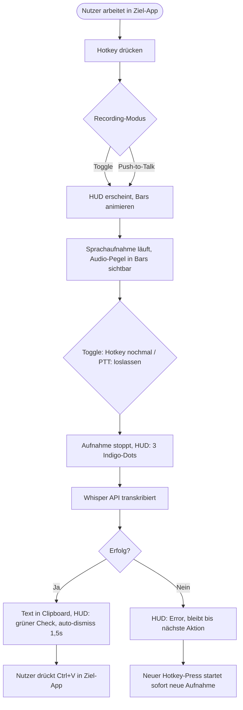
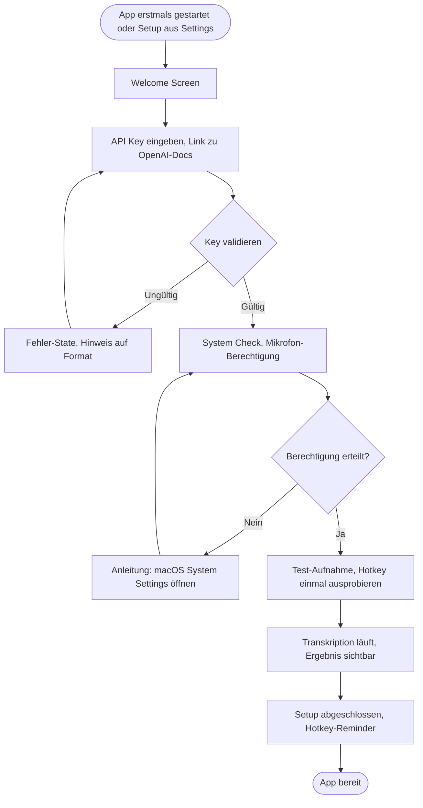
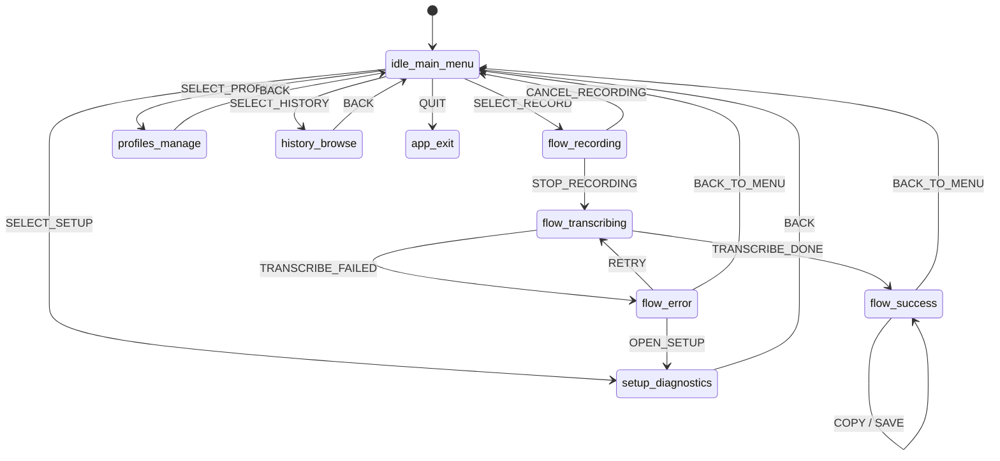

# UX Design Specification agent-flow

**Author:** Yoda
**Date:** 2026-02-21

---

<!-- UX design content will be appended sequentially through collaborative workflow steps -->

## Executive Summary

### Project Vision

WhisperFlow ist eine unsichtbare Desktop-App (Electron, macOS-first), die Voice-to-Text-Transkription als erstklassigen Input-Kanal in den Entwickler-Workflow integriert. Die App läuft im System Tray, wird über globale Shortcuts aktiviert und liefert Transkriptionsergebnisse direkt in die Zwischenablage — ohne Kontextwechsel, ohne UI-Overhead. Der Kernmoment: Shortcut drücken → sprechen → loslassen → Text ist nutzbar.

Differenzierer: **Frictionless Availability** — WhisperFlow ist immer verfügbar wie eine Tastenkombination und verschwindet nach getaner Arbeit.

### Target Users

**Primär: Softwareentwickler (macOS)**

- Technisch versiert, keyboard-driven, erwartet native macOS-Qualität
- Nutzt Voice für Diktate: Commit-Messages, PR-Beschreibungen, Tickets, Slack-Nachrichten, Dokumentation
- Nutzt Voice für Transkription: Meetings, Calls, Videos
- Frustriert von: Kontextwechsel, inakzeptabler Latenz, unzureichender Qualität für technische Inhalte
- Erwartet: Tool verhält sich wie OS-native Feature — zuverlässig, schnell, immer verfügbar

### Key Design Challenges

1. **Unsichtbarkeit vs. Feedback**: Die App soll im Hintergrund verschwinden — aber der Nutzer braucht klares Feedback über Recording-Status, API-Verarbeitung und Ergebnis. Balance zwischen Minimal-UI und ausreichend Orientierung ist die zentrale UX-Herausforderung.
2. **Onboarding-Hürde**: Nutzer müssen einen Whisper API-Key einrichten bevor sie den ersten Mehrwert erleben. Dieser technische Setup muss frictionless, motivierend und fehlerresistent gestaltet sein. (FFmpeg ist gebündelt — kein User-Install.)
3. **Fehler-Kommunikation im Kontext**: Fehler (API-Fehler, FFmpeg nicht gefunden, schlechte Aufnahme) passieren während der Nutzer in einer anderen App arbeitet. Nicht-invasive aber wirksame Fehler-Kommunikation ohne Unterbrechung des Workflows.

### Design Opportunities

1. **HUD als Signature-Moment**: Das kurze Feedback-Fenster (Recording → Transcribing → Done) ist die einzige UI, die Nutzer regelmäßig sehen. Es kann ein Qualitäts-Statement sein — präzise, schnell, satisfying. Dieser Moment kann WhisperFlow von anderen Tools differenzieren.
2. **Shortcut-Erlebnis als Produktmoment**: Der Übergang von "Ich drücke Shortcut und spreche" zu "Text ist in der Zwischenablage" kann sich wie Magie anfühlen — dieser Flow muss mit höchster UX-Sorgfalt gestaltet werden.
3. **Progressive Disclosure im Onboarding**: Technische Komplexität (FFmpeg, API-Key, BlackHole) schrittweise einführen. Nutzer soll so früh wie möglich den "Aha-Moment" erleben, bevor alle Abhängigkeiten konfiguriert sind.

## Core User Experience

### Defining Experience

Der Kern-Loop ist: Shortcut halten → sprechen → loslassen → Text in der Zwischenablage.
Der kritische UX-Moment liegt im Zwischenraum: Die Qualität des Feedbacks während
Recording und Transcribing entscheidet darüber, ob Nutzer dem System vertrauen.
WhisperFlow muss in jedem State klar kommunizieren, was gerade passiert —
ohne Ablenkung, ohne Interaktion zu erfordern.

### Platform Strategy

- Primär: macOS Desktop, vollständig keyboard-driven
- Kein Maus-Klick im Core-Flow erforderlich
- Globaler Shortcut funktioniert unabhängig von der fokussierten App
- App verhält sich wie ein OS-natives Feature, nicht wie eine Applikation

### Effortless Interactions

- Shortcut-Aktivierung: sofortige visuelle Reaktion, kein spürbarer Delay
- **Audio-Pegel-Visualisierung (Echtzeit)**: Nutzer sieht den Ausschlag von Mikrofon
  oder System-Audio live im HUD — visueller Beweis, dass die Aufnahme läuft und
  Ton ankommt. Ohne dieses Feedback fehlt die Gewissheit, dass überhaupt etwas
  aufgenommen wird.
- State-Wechsel Recording → Transcribing → Done: klar, lesbar, kein Rätselraten
- Clipboard-Output: Text ist nach Done sofort verfügbar, kein weiterer Schritt

### Critical Success Moments

- **Erster Test im Onboarding**: Nutzer spricht und sieht den Pegel im HUD ausschlagen —
  das ist der Aha-Moment, der den Wert beweist
- **State-Wechsel zu "Transcribing"**: Nutzer lässt Shortcut los und sieht sofort
  Feedback — kein Dead-Air, kein Unsicherheitsgefühl
- **"Success"-State**: Text ist da — dieser Moment muss satisfying sein

### Experience Principles

1. **Vertrauen durch Sichtbarkeit**: Jeder State ist klar kommuniziert — der
   Echtzeit-Pegel ist der wichtigste Vertrauensanker während der Aufnahme
2. **Null Interaktion im Core-Flow**: HUD ist passiv, kein Klick, kein Hover —
   der Nutzer bleibt in seiner primären App
3. **Keyboard-first, always**: Kein Feature des Core-Flows erfordert eine Maus
4. **Feedback ist das Produkt**: Die App ist unsichtbar — aber ihr Feedback-Layer
   ist das einzige, was Nutzer je sehen, und muss daher exzellent sein.

## Desired Emotional Response

### Primary Emotional Goals

WhisperFlow soll sich anfühlen wie ein erstklassiges macOS-Native-Tool —
modern, präzise, professionell. Nutzer sollen das Gefühl haben, ein
Werkzeug zu benutzen, das von jemandem gebaut wurde, der ihren Workflow versteht.

- **Vertrauen**: "Das funktioniert — immer."
- **Effizienz**: "Das geht schneller als ich dachte."
- **Kontrolle**: "Ich weiß jederzeit, was passiert."

### Emotional Journey Mapping

| Phase                                 | Gewünschte Emotion                  | Zu vermeiden               |
| ------------------------------------- | ----------------------------------- | -------------------------- |
| Shortcut drücken                      | Sofortige Bestätigung, Sicherheit   | Unsicherheit ob es losging |
| Während der Aufnahme (Pegel sichtbar) | Vertrauen, Fokus                    | Zweifel, Ablenkung         |
| State-Wechsel zu Transcribing         | Entspannung, Erwartung              | Dead-Air, Angst            |
| Success-State                         | Satisfying Abschluss, Zufriedenheit | Anticlimactic              |
| Fehlerfall                            | Klarheit, Handlungsfähigkeit        | Frustration, Ratlosigkeit  |

### Micro-Emotions

- **Confidence** über Skepticism: Nutzer vertraut dem System nach wenigen
  erfolgreichen Nutzungen blind
- **Accomplishment** über Frustration: Jeder erfolgreiche Shortcut-zu-Text-Loop
  fühlt sich wie ein kleiner Sieg an
- **Calm Focus** über Anxiety: Der Pegel-Indikator nimmt die Unsicherheit
  während der Aufnahme vollständig weg

### Design Implications

- **Modern Professional, kein Spielzeug**: Farbpalette dunkel/neutral mit
  präzisen Akzentfarben — kein buntes UI, kein Gradient-Overkill
- **Animationen als Qualitätssignal**: Subtile, schnelle Transitions zwischen
  HUD-States (Recording → Transcribing → Done) kommunizieren Präzision,
  nicht Verspieltheit. Denk Raycast, Linear — nicht Duolingo.
- **Fehler menschlich, aber knapp**: "API-Key ungültig — Einstellungen öffnen"
  statt "Error 401". Klar, handlungsorientiert, kein technischer Dump.
- **Pegel-Animation**: Smooth, reaktiv, präzise — kein pixeliges Balken-Widget,
  sondern eine saubere Wellenform oder Bars die auf die Stimme reagieren

### Emotional Design Principles

1. **Professionell ≠ Langweilig**: Animationen sind erlaubt und gewünscht —
   sie müssen aber Zweck und Qualität kommunizieren, nicht Aufmerksamkeit fordern
2. **Jeden Fehler entwaffnen**: Fehlerzustände fühlen sich nie wie eine Sackgasse
   an — immer mit klarem nächsten Schritt
3. **Satisfying Completion**: Der Success-State ist der emotionale Höhepunkt
   jeder Nutzung — er verdient besondere Sorgfalt in Animation und Feedback
4. **Unsichtbar bis gebraucht, exzellent wenn sichtbar**: Wenn das HUD erscheint,
   muss es das beste kurze UI-Erlebnis des Tages sein

## UX Pattern Analysis & Inspiration

### Inspiring Products Analysis

**Raycast**

- Keyboard-first, erscheint on-demand und verschwindet ohne Spur
- Blitzschnelle Reaktionszeit — keine wahrnehmbare Latenz nach Shortcut
- Animationen sind präzise und minimal, kommunizieren Qualität ohne abzulenken
- Fehler-Handling klar und handlungsorientiert
- _Relevanz für WhisperFlow_: Der gesamte Interaction-Ansatz — App als OS-Extension, nicht als eigenständige Anwendung

**Linear**

- Dark-mode-first, hochpräzises visuelles Design ohne Verspieltheit
- Jede Interaktion fühlt sich durchdacht an — kein Feature wirkt angeheftet
- Subtile Micro-Animationen die Zustandsänderungen kommunizieren
- _Relevanz für WhisperFlow_: Visuelles Qualitätsniveau und Ton für dark-mode HUD-Design

**macOS Native UI-Conventions (Spotlight, Notification Center)**

- Passives Overlay-Verhalten — erscheint, informiert, verschwindet
- System-integriertes Look & Feel schafft sofortiges Vertrauen
- _Relevanz für WhisperFlow_: HUD-Verhalten und Positionierung

### Transferable UX Patterns

**Overlay/HUD-Patterns:**

- Zentriertes oder Ecken-positioniertes Overlay mit definiertem Z-Index über allem
- Auto-dismiss nach Success mit kurzer Verzögerung (1–2 Sek.)
- Smooth fade-in/out — nie abruptes Erscheinen oder Verschwinden

**Audio-Feedback-Patterns:**

- Echtzeit-Pegel als animierte Bars oder Wellenform (vertikal reagierend auf Amplitude)
- Visueller Unterschied zwischen "Stille erkannt" und "Aktive Aufnahme"
- Timer-Anzeige während Recording für Orientierung

**State-Transition-Patterns:**

- Klare visuelle Unterscheidung zwischen Recording (aktiv/rot) → Transcribing (neutral/spinner) → Done (grün/check)
- Transition-Animationen zwischen States: 150–200ms ease-out

### Anti-Patterns to Avoid

- **Modal-Blocker**: HUD darf nie die Arbeit in der primären App unterbrechen oder blockieren
- **Information Overload**: HUD zeigt nur den aktuellen State — keine Metriken, keine Buttons, kein Text-Preview
- **Blink-Animationen**: Kein Blinken für Aufmerksamkeit — zu aggressiv für ein Hintergrund-Tool
- **Lange Onboarding-Flows**: Kein mehrseitiger Wizard vor dem ersten Mehrwert-Erlebnis
- **Technische Fehlermeldungen**: Kein Raw-Error-Text im HUD — immer übersetzt in Nutzersprache

### Design Inspiration Strategy

**Übernehmen:**

- Raycast's Keyboard-first-Philosophie: WhisperFlow ist ein OS-Feature, keine App
- Linear's dunkles, präzises visuelles System als Vorbild für Farbpalette und Typografie

**Adaptieren:**

- Spotlight's Overlay-Positionierung: angepasst für persistente State-Anzeige statt Input-Feld
- Raycast's Animations-Timing: auf Audio-Feedback-Kontext angepasst (reaktiver, lebendiger)

**Vermeiden:**

- Jede Form von Gamification oder "Achievement"-Feedback
- Bunte Farbpaletten oder illustrative Elemente
- Interaktive Elemente im HUD-Overlay

## Design System Foundation

### Design System Choice

**Radix UI + Tailwind CSS** mit Dark-mode-first als Basis.

Radix UI liefert vollständig headless, zugängliche Primitives ohne visuelles Opinionating —
jede Komponente ist vollständig anpassbar. Tailwind CSS übernimmt das Styling-System.
Animationen via `framer-motion` für HUD-Transitions.

### Rationale for Selection

- **Headless Primitives**: Radix UI gibt keine visuelle Meinung vor — WhisperFlow
  sieht aus wie WhisperFlow, nicht wie ein Framework
- **Accessibility first**: ARIA-Patterns, Keyboard-Navigation und Focus-Management
  sind eingebaut — kein manueller Aufwand
- **Dark-mode-first**: Tailwind's dark-mode-Support macht dies zur Standardkonfiguration,
  nicht zum Nachgedanken
- **Electron-kompatibel**: Kein Browser-spezifisches Overhead, kleine Bundle-Size
- **Professioneller Ästhetik**: Ohne Framework-Gesicht — passt zur Raycast/Linear-Referenzästhetik

### Implementation Approach

- `@radix-ui/react-*` Primitives für Basis-Komponenten (Dialog, Tooltip, Popover, etc.)
- Tailwind CSS für alle Styles mit custom Design Tokens
- `framer-motion` für HUD-State-Transitions und Audio-Pegel-Animationen
- CSS Custom Properties für Farb-Theme-Variablen (dark als default, light optional)

### Customization Strategy

- **Design Tokens**: Farbpalette, Spacing, Typografie als Tailwind-Config definiert
- **Component Layer**: Eigene Wrapper-Komponenten über Radix-Primitives mit
  WhisperFlow-spezifischem Styling
- **HUD-Komponenten**: Vollständig custom — kein Radix-Primitive nötig, da
  kein Standard-Pattern passt
- **Theme**: Dark-mode als einziger unterstützter Mode im MVP (light optional später)

## 2. Core User Experience

### 2.1 Defining Experience

WhisperFlow's definierende Erfahrung in einem Satz:
**"Shortcut drücken → sprechen → Shortcut drücken → Text ist in der Zwischenablage."**

Das ist der Satz, den ein Nutzer seinem Kollegen beschreibt. Keine App öffnen,
kein Fenster wechseln, kein Upload — ein zweifacher Tastendruck und der Text ist da.

### 2.2 User Mental Model

Nutzer denken an WhisperFlow wie an eine **Tastenkombination mit Superkraft** —
nicht als App, nicht als Service, sondern als erweiterte OS-Funktion.
Mentales Modell: "Ich drücke Cmd+Shift+Space wie ich Cmd+C drücke — nur spreche ich statt zu tippen."

Existing frustrations mit aktuellen Lösungen:

- Kontextwechsel zu einer dedizierten App unterbricht den Flow
- Unklares Feedback ob die Aufnahme läuft
- Schlechte Qualität für technischen Wortschatz

### 2.3 Success Criteria

- Shortcut-Reaktion: HUD erscheint in < 200ms nach Tastendruck
- Audio-Pegel sichtbar innerhalb der ersten Sekunde der Aufnahme
- State-Wechsel Recording → Transcribing unmittelbar nach zweitem Shortcut
- Success-Animation + auto-dismiss nach ~1,5 Sek. — kein manuelles Schließen nötig
- Text ist in der Zwischenablage bevor das HUD verschwindet

### 2.4 Novel UX Patterns

WhisperFlow kombiniert bekannte Patterns neu:

- **Spotlight-Metapher** (unsichtbar bis gebraucht) + **Recording-Mechanic** (aktiver Prozess)
- Das HUD ist kein Fenster — es ist temporäres Feedback-Overlay ohne Interaktionsfläche
- Keine bekannte App kombiniert diese beiden Patterns auf diese Weise für Voice-Input

### 2.5 Experience Mechanics

**Initiation:**

- Default-Modus: **Toggle** — erster Shortcut startet Recording, zweiter stoppt
- Begründung: Toggle unterstützt sowohl kurze Diktate als auch längere Meeting-Transkriptionen
- Alternativer Push-to-Talk-Modus in Settings → General wählbar
- **Recording Mode** wird pro Profil konfiguriert (Settings → Profile) — kein globaler Mode mehr

**Interaction:**

- HUD erscheint sofort am konfigurierten Bildschirmort (konfigurierbar in Settings)
- HUD zeigt: Recording-State-Label + Echtzeit-Audio-Pegel (Bars/Wellenform) + Timer
- Kein Klick, kein Hover, keine Interaktion mit dem HUD während der Aufnahme

**Feedback während Recording:**

- Audio-Pegel-Visualisierung reagiert live auf Mikrofon/System-Audio
- Timer zeigt Aufnahmedauer
- Visueller Unterschied: aktive Stimme vs. Stille erkennbar

**Completion:**

- Zweiter Shortcut → HUD wechselt zu "Transcribing"-State (Spinner/Animation)
- Nach erfolgreicher Transkription: Success-State mit kurzer Animation
- Auto-dismiss nach ~1,5 Sek. — Text ist bereits in der Zwischenablage
- Fehlerfall: Error-State mit kurzem Hinweistext + Action-Link (z.B. "Einstellungen")

## Visual Design Foundation

### Color System

**Palette — Dark-first, Professional:**

| Token          | Wert      | Verwendung                                   |
| -------------- | --------- | -------------------------------------------- |
| `background`   | `#0A0A0B` | App-Hintergrund, HUD-Basis                   |
| `surface`      | `#141415` | Karten, Panels, HUD-Container                |
| `border`       | `#2A2A2D` | Subtile Trenner, Outlines                    |
| `text-primary` | `#FAFAFA` | Primärer Text, hoher Kontrast                |
| `text-muted`   | `#8A8A8E` | Labels, sekundäre Beschriftungen             |
| `accent`       | `#6366F1` | Indigo — Primär-Akzent, interaktive Elemente |
| `recording`    | `#EF4444` | Rot — Recording-State, universelles Signal   |
| `success`      | `#22C55E` | Grün — Success-State, Completion             |
| `warning`      | `#F59E0B` | Amber — Warnungen, Hinweise                  |
| `error`        | `#EF4444` | Identisch mit recording — konsistentes Rot   |

**Semantic Mapping:**

- HUD Recording-State: `recording` (#EF4444) als dominante Farbe
- HUD Transcribing-State: `accent` (#6366F1) + Spinner
- HUD Success-State: `success` (#22C55E) + kurze Animation
- HUD Error-State: `error` + menschlicher Hinweistext

**Accessibility:**

- Alle Text/Hintergrund-Kombinationen erfüllen WCAG AA (Kontrast ≥ 4.5:1)
- `text-primary` auf `background`: ~15:1 — herausragend
- `text-muted` auf `surface`: ~4.6:1 — AA-compliant

### Typography System

| Rolle                 | Font           | Größe | Gewicht | Verwendung                        |
| --------------------- | -------------- | ----- | ------- | --------------------------------- |
| HUD State Label       | Inter          | 13px  | 500     | "Recording...", "Transcribing..." |
| HUD Timer             | Inter          | 12px  | 400     | Aufnahmedauer                     |
| Notification/Snackbar | Inter          | 13px  | 400     | Kurze System-Meldungen            |
| Settings Heading      | Inter          | 16px  | 600     | Abschnitts-Überschriften          |
| Settings Body         | Inter          | 13px  | 400     | Erklärungstexte                   |
| Settings Mono         | JetBrains Mono | 12px  | 400     | API-Keys, technische Werte        |

**Begründung:**

- **Inter**: Hervorragende Lesbarkeit bei kleinen Größen, macOS-nativ ähnlich, modern professional
- **JetBrains Mono**: Für technische Inhalte (API-Keys, Shortcuts) — Entwickler erkennen und schätzen es

### Spacing & Layout Foundation

**Base Unit: 4px**

| Token     | Wert | Verwendung                       |
| --------- | ---- | -------------------------------- |
| `space-1` | 4px  | Minimaler Innenabstand, Icon-Gap |
| `space-2` | 8px  | Kompakte Elemente                |
| `space-3` | 12px | Standard-Padding                 |
| `space-4` | 16px | Sektionstrennung                 |
| `space-6` | 24px | Große Sektionen                  |
| `space-8` | 32px | Seitenränder                     |

**HUD-Dimensionen:**

- Breite: 280px (fix) — kompakt, nicht überwältigend
- Höhe: variabel je State, ~80–96px
- Border-radius: 12px — modern, nicht eckig
- Shadow: `0 8px 32px rgba(0,0,0,0.4)` — hebt sich klar vom Desktop ab

### Accessibility Considerations

- Dark-mode als einziger unterstützter Theme im MVP
- Alle interaktiven Elemente (Settings) haben sichtbaren Focus-Ring (accent-farbe)
- Keyboard-Navigation vollständig unterstützt (Radix UI liefert dies built-in)
- System-Prefer-Reduced-Motion wird respektiert: Animationen werden vereinfacht
- HUD-Text ist immer über WCAG AA Kontrast

## Design Direction Decision

### Design Directions Explored

Vier HUD-Richtungen wurden evaluiert:

| Direction           | Form        | Größe   | Pegel-Feedback    |
| ------------------- | ----------- | ------- | ----------------- |
| A — Floating Pill   | Pill/Kapsel | Kompakt | Bars (vertikal)   |
| B — Rounded Card    | Karte       | Mittel  | Volle Wellenform  |
| C — Corner Badge    | Micro-Pill  | Minimal | Mini-Bars         |
| D — Spotlight Modal | Breite Card | Groß    | Breite Wellenform |

Interaktiver HTML-Showcase: `_bmad-output/planning-artifacts/ux-design-directions.html`

### Chosen Direction

**Direction A — Floating Pill**

Das HUD erscheint als schmale Pill-Form mit State-Differenzierung durch rein visuelle Mittel:

| State        | Darstellung                                                                  |
| ------------ | ---------------------------------------------------------------------------- |
| Recording    | Graue Bars (`#5A5A62`), animiert nach Audio-Amplitude — kein Icon, kein Text |
| Transcribing | Drei pulsierende Indigo-Dots — kein Spinner                                  |
| Success      | Grüner Check-Icon, Pop-Animation, auto-dismiss nach 1,5s                     |
| Error        | Warn-Icon + Text „Error" — einziger State mit Text                           |

### Design Rationale

- **Minimalste UI-Fläche**: Pill-Form stört den Arbeitsfokus am wenigsten
- **Keine Text-Redundanz**: Bars und Icons kommunizieren den State — Text wäre überflüssig und ablenkend
- **Grau als neutrale Pegel-Farbe**: Rot bleibt exklusiv für Fehlerzustände reserviert
- **Passt zur Raycast/Linear-Ästhetik**: Dezent, professionell, verschwindet nach getaner Arbeit
- **HUD-Position**: konfigurierbar in Settings (Default: Bottom Center)

## User Journey Flows

### Journey 1 — Core Recording Loop

Der primäre tägliche Workflow — mehrfach täglich ausgeführt.



**Optional — Transcript Overlay (Default: OFF):**
Nach erfolgter Transkription kann ein Text-Preview-Overlay für konfigurierbare Dauer eingeblendet werden. Standardmäßig deaktiviert; einstellbar in Settings.

### Journey 2 — First Run & Onboarding

Einmaliger Launch-Flow — jederzeit aus Settings → Setup neu startbar.



### Journey 3 — Error Recovery

**Kern-Prinzip: Error ist non-blocking.** Kein Modal, keine erzwungene Interaktion — der Nutzer kann jederzeit einfach den Hotkey drücken und eine neue Aufnahme starten.


### Journey Patterns

| Pattern                       | Beschreibung                                                        |
| ----------------------------- | ------------------------------------------------------------------- |
| **Zero-UI-Success**           | Erfolg kommuniziert sich selbst — keine Interaktion nötig           |
| **Non-Blocking Error**        | Fehler blockiert nie — nächster Hotkey-Press überschreibt den State |
| **Hotkey-Konsistenz**         | Eine Taste für alles: Start, Stop, Error-Dismiss                    |
| **Settings als Escape-Hatch** | Tiefere Korrekturen (API-Key, Mikrofon, Setup) laufen über Settings |

## Component Strategy

### Design System Components (Radix UI — direkt nutzbar)

| Component   | Verwendung                                                                                                          |
| ----------- | ------------------------------------------------------------------------------------------------------------------- |
| `Switch`    | Settings-Toggles (Transcript Overlay, Push-to-Talk, Auto-Launch, LLM pro Profil)                                    |
| `TextField` | API-Key-Input, Profil-Name, System-Prompt-Name, Glossar-Name                                                        |
| `Select`    | HUD-Position, Audio-Device-Auswahl, Whisper-Modell, LLM-Modell                                                      |
| `Tabs`      | Settings-Navigation (General / Shortcuts / Profile / System Prompts / Glossare / API Key / Audio / Display / About) |
| `Textarea`  | System-Prompt-Text, Glossar-Text                                                                                    |
| `Tooltip`   | Hotkey-Hints in der App                                                                                             |
| `Dialog`    | Onboarding-Flow-Container                                                                                           |

### Custom Components

#### `HUDOverlay`

**Purpose:** Always-on-top Electron-Overlay, rendert den aktuellen Recording-State
**States:** `idle` (unsichtbar) → `recording` → `transcribing` → `success` → `error`
**Transitions:** CSS animations, kein Framer Motion
**Besonderheit:** Electron `always-on-top`, click-through wenn `idle`, eigenes BrowserWindow

#### `AudioLevelBars`

**Purpose:** Echtzeit-Pegel-Visualisierung während Recording
**Inhalt:** 10 vertikale Bars, Höhe via Web Audio API gesteuert
**Farbe:** `#5A5A62` (neutral grau)
**Fallback:** CSS-Animation wenn kein Audio-Signal

#### `KeyboardBadge`

**Purpose:** Tastenkombinationen visuell darstellen — z.B. `⌘⇧Space`
**Varianten:** `sm` (inline in Text), `md` (Settings-Zeile)
**Editierbar:** Im Shortcut-Tab per Record-to-Key-Capture-Mechanismus

#### `TranscriptOverlay`

**Purpose:** Optionales Text-Preview nach Transkription
**Default:** OFF, aktivierbar in Settings
**Verhalten:** Erscheint für X Sekunden (konfigurierbar), auto-dismiss
**Position:** Nahe HUD, konfigurierbar

#### `OnboardingFlow`

**Purpose:** 4-Step First-Run-Wizard
**Steps:** Welcome → API Key → System Check → Test Recording
**Wiederholbar:** Jederzeit aus Settings → „Setup neu starten"
**Container:** Radix `Dialog` mit eigenem Step-Progress-Indicator

### Component Implementation Strategy

- Custom Components bauen auf Radix UI Design Tokens auf (Farben, Spacing, Typografie)
- HUDOverlay lebt in einem separaten Electron BrowserWindow — kein React-DOM-Sharing mit Settings-Fenster
- CSS animations statt Framer Motion — leichtgewichtiger, kein zusätzliches Bundle
- KeyboardBadge nutzt macOS-Symbol-Konventionen (⌘, ⇧, ⌃, ⌥)

### Implementation Roadmap

| Phase                    | Components                                  | Kritisch für   |
| ------------------------ | ------------------------------------------- | -------------- |
| **Phase 1 — Core**       | `HUDOverlay`, `AudioLevelBars`              | Recording Loop |
| **Phase 2 — Settings**   | `KeyboardBadge`, Radix `Tabs/Switch/Select` | Konfiguration  |
| **Phase 3 — Onboarding** | `OnboardingFlow`, `TranscriptOverlay`       | First Run      |

## UX Consistency Patterns

### Feedback Patterns

Alle Feedback-States folgen demselben Prinzip: **passiv, nicht-blockierend, visuell eindeutig.**

| State                 | Wo                    | Darstellung                                    |
| --------------------- | --------------------- | ---------------------------------------------- |
| Erfolg                | HUD                   | Grüner Check-Icon, auto-dismiss 1,5s           |
| Fehler (HUD)          | HUD                   | Warn-Icon + „Error", bleibt bis nächste Aktion |
| Fehler (Settings)     | Inline unter dem Feld | Roter Text, kein Modal                         |
| Validierung (pending) | Inline                | Indigo-Spinner neben dem Feld                  |
| Validierung (Erfolg)  | Inline                | Grüner Check neben dem Feld                    |

**Regel:** Fehler erscheinen immer dort, wo sie entstehen — nie als globales Modal.

### Form Patterns

#### API-Key-Input

- Typ: `password` (verborgen, Toggle zum Anzeigen)
- Validierung: On-blur + auf Klick „Speichern"
- Fehler: Inline unter dem Feld, rot, kurzer erklärender Text
- Erfolg: Inline grüner Check, kein Toast

#### Hotkey-Capture-Feld

- Zeigt aktuellen Hotkey als `KeyboardBadge`
- Klick auf „Ändern" → Feld wechselt in Capture-Mode: „Drücke neue Tastenkombination..."
- Konflikt-Check: Falls Hotkey bereits systemweit belegt → Inline-Warnung
- Abbrechen: Escape verlässt Capture-Mode ohne Änderung

#### Allgemeine Formregeln

- Labels immer sichtbar (kein Placeholder als Ersatz)
- Pflichtfelder kein `*` — alle Felder in WhisperFlow sind implizit nötig
- Speichern-Button nur aktiv wenn sich etwas geändert hat

### Button-Hierarchie

| Ebene         | Stil                              | Verwendung                                          |
| ------------- | --------------------------------- | --------------------------------------------------- |
| **Primary**   | Indigo-Hintergrund, weißer Text   | Hauptaktion pro Screen (z.B. „Speichern", „Weiter") |
| **Secondary** | Transparenter Hintergrund, Border | Nebenaktionen (z.B. „Abbrechen", „Zurück")          |
| **Ghost**     | Nur Text, kein Border             | Tertiäre Aktionen, Settings-Links                   |

**Regel:** Pro Screen/Step maximal ein Primary-Button.

### Navigation Patterns

#### Settings-Fenster

- Sidebar-Navigation links (Radix `Tabs` vertikal)
- Aktiver Tab: Indigo-Akzentfarbe + leichter Hintergrund
- Tabs: General · Shortcuts · API Key · Audio · Display · About
- Kein Breadcrumb nötig — flache Hierarchie

#### Onboarding-Flow

- Linearer Step-Indicator oben (1 → 2 → 3 → 4)
- Aktiver Step: Indigo-Punkt, abgeschlossene Steps: grün
- Navigation: „Weiter" (Primary) + „Zurück" (Secondary)
- Kein „Überspringen" — alle Steps sind nötig

### Loading / Validation States

| Situation                   | Pattern                                     |
| --------------------------- | ------------------------------------------- |
| API-Key wird validiert      | Spinner inline neben Feld, Button disabled  |
| Mikrofon-Check läuft        | Pulsierendes Icon, Text „Wird geprüft..."   |
| Test-Aufnahme in Onboarding | HUD-Component direkt im Onboarding sichtbar |

### Allgemeine Konsistenz-Regeln

- **Farb-Semantik ist strikt**: Grün = Erfolg, Rot = Fehler/Danger, Indigo = Aktion/Aktiv, Grau = neutral
- **Kein Rot im Recording-State** — Rot bleibt exklusiv für Fehler
- **Tastatur-First**: Alle Aktionen per Tab + Enter + Escape erreichbar
- **Focus-Ring**: Immer sichtbar, Indigo (`#6366F1`), 2px Offset

## Responsive Design & Accessibility

### Platform-Strategie

WhisperFlow ist macOS-exklusiv. Klassisches responsive Design (Mobile/Tablet-Breakpoints) entfällt. Relevante Anpassungsebenen sind:

1. **Settings-Fenstergröße** — skalierbar mit definierter Mindestgröße
2. **Retina/HiDPI** — Assets und Icons scharf auf @2x Displays
3. **System-Preferences** — macOS Accessibility-Settings werden respektiert

### Fenster-Strategie

**Settings-Fenster:**

- Mindestgröße: **700×500px** (Electron `minWidth`/`minHeight`)
- Skalierbar nach oben — Layout nutzt verfügbaren Raum
- Sidebar bleibt fix (220px), Content-Bereich wächst
- Kein horizontales Scrolling innerhalb des Content-Bereichs

**HUD-Overlay:**

- Feste Größe, nicht skalierbar
- Position konfigurierbar in Settings
- Immer `always-on-top`, `click-through` im Idle-State

### HiDPI / Retina

- Alle Icons als SVG (skalieren verlustfrei)
- Keine Bitmap-Assets wo vermeidbar
- CSS in `rem`/`px` — Electron skaliert via Device Pixel Ratio automatisch

### Accessibility-Strategie (MVP)

**In Scope:**

- WCAG AA Kontrast für alle Text/Hintergrund-Kombinationen (bereits im Farbsystem sichergestellt)
- Vollständige Keyboard-Navigation (Tab, Enter, Escape, Pfeiltasten)
- Sichtbarer Focus-Ring auf allen interaktiven Elementen (Indigo, 2px)
- `prefers-reduced-motion`: Alle CSS-Animationen deaktiviert wenn aktiv

**Out of Scope (MVP):**

- VoiceOver-Kompatibilität
- ARIA-Vollständigkeit über Radix UI Built-ins hinaus
- WCAG AAA

### Keyboard-Navigation-Spezifikation

| Taste               | Aktion                                                 |
| ------------------- | ------------------------------------------------------ |
| `Tab` / `Shift+Tab` | Navigation zwischen Elementen                          |
| `Enter` / `Space`   | Aktion ausführen                                       |
| `Escape`            | Abbrechen / Settings schließen / Onboarding verlassen  |
| Globaler Hotkey     | Recording starten/stoppen (systemweit, konfigurierbar) |

## History Overlay

### Konzept & Kontext

Das History Overlay ermöglicht schnellen Zugriff auf vergangene Transkriptionen — ohne die laufende Arbeit zu unterbrechen. Es folgt dem Spotlight-Paradigma: zentriertes Overlay über allem, Search direkt im Fokus, Tastatur-first. Der Nutzer drückt `Cmd+Shift+H`, sieht sofort die jüngste Transkription highlighted und kann per Pfeiltasten + Enter in Sekunden zugreifen.

Kernprinzip: **Das Overlay erscheint, liefert, verschwindet.** Kein Fenster öffnen, kein Klicken, kein Kontextwechsel.

---

### Trigger & Positionierung

- **Shortcut:** `Cmd+Shift+H` (konfigurierbar in Settings → Shortcuts)
- **Fenstertyp:** Electron `BrowserWindow`, `always-on-top`, `click-through` außerhalb des Overlays
- **Position:** Konfigurierbar in Settings — identische Optionen wie beim HUD (Default: `center`)
  - `center` — Bildschirmmitte horizontal, leicht oberhalb der Mitte vertikal (~40% von oben)
  - `top` — Oberes Drittel des Screens, zentriert horizontal
  - `mouse-cursor` — Nahe der aktuellen Mausposition, mit Screen-Edge-Detection

---

### Visuelle Spezifikation

**Container:**

| Property        | Wert                           |
| --------------- | ------------------------------ |
| Breite          | 720px (fix)                    |
| Max-Höhe        | 560px (danach scrollbar)       |
| Border-radius   | 14px                           |
| Hintergrund     | `#141415` (`surface`)          |
| Border          | 1px solid `#2A2A2D` (`border`) |
| Shadow          | `0 20px 60px rgba(0,0,0,0.6)`  |
| Backdrop-filter | `blur(20px)` — Glass-Effekt    |

**Search-Input (oben):**

| Property    | Wert                                                           |
| ----------- | -------------------------------------------------------------- |
| Höhe        | 52px                                                           |
| Hintergrund | `#0A0A0B` (`background`)                                       |
| Font        | Inter 15px, weight 400                                         |
| Placeholder | `„Transkriptionen durchsuchen..."` (grau `#8A8A8E`)            |
| Icon links  | Lupe-Icon, `#8A8A8E`, 16px                                     |
| Trenner     | 1px `border` Linie unter dem Input                             |
| Focus-Ring  | Kein äußerer Focus-Ring — das Feld ist beim Öffnen immer aktiv |

**Listenbereich:**

- Direkt unter dem Search-Input
- Scrollbar (native macOS-Scrollbar, overlay-style — erscheint nur beim Scrollen)
- Kein festes Eintrags-Limit — alle Einträge der History ladbar
- **Keine Trennlinien** zwischen Einträgen — nur Whitespace als Trenner (Raycast-artig)
- Padding: 4px vertikal, 0 horizontal

---

### Listeneintrag Anatomie

Jeder Eintrag ist **48px hoch**, Single-Line-Layout mit drei Zonen:

**Drei-Zonen-Layout (links → mitte → rechts):**

| Zone             | Position        | Inhalt                             | Stil                                 |
| ---------------- | --------------- | ---------------------------------- | ------------------------------------ |
| **Icon-Badge**   | Links fix       | Recording-Mode-Icon, 20×20px Badge | `#1E1E24` Badge-BG, Icon `#8A8A8E`   |
| **Preview-Text** | Mitte flex-grow | Erste 100 Zeichen + `…`            | Inter 13px, `#FAFAFA`, single-line   |
| **Meta rechts**  | Rechts fix      | Timestamp · Modus-Label            | Inter 11px, `#5A5A62`, flex-shrink 0 |

**Icon-Badge (linke Spalte):**

- Größe: 20×20px, Border-radius 6px
- Hintergrund: `#1E1E24`
- Icon: 12px SVG, Farbe `#8A8A8E`
- Kein Text-Label im Badge

| Modus          | Icon-Variante   |
| -------------- | --------------- |
| Mikrofon       | Mic-Icon        |
| System-Output  | Monitor-Icon    |
| Dual Recording | Merge/Dual-Icon |

**Hover-State:**

- Hintergrund: `#1A1A1C`
- Kein Border, kein Scale

**Highlight-State (aktiver Eintrag) — stark:**

- Hintergrund: `#25253A` — deutliches Indigo-Tint, klar sichtbar
- Linke Border: 2px solid `#6366F1` (accent)
- Preview-Text: `#FFFFFF` (maximale Helligkeit)
- Meta rechts: `#8A8A8E` (etwas heller als Normalzustand)
- Icon-Badge Hintergrund: `#2D2D4A` (hellt sich mit Eintrag auf)

---

### Layout-Struktur (ASCII)

```
┌──────────────────────────────────────────────────────────────────────────┐
│  [Lupe]  Transkriptionen durchsuchen...                                  │
├──────────────────────────────────────────────────────────────────────────┤
│                                                                          │
│▌ [Dual] Meeting Notes - Product Roadmap Q1 war das wichtigste…  5 Min · Dual │  ← highlighted
│                                                                          │
│  [Mic]  Commit message for auth refactor: fix token refresh rac…  18 Min · Mic │
│                                                                          │
│  [Mic]  Email to the team about the monday deadline extension r…  1 Std · Mic  │
│                                                                          │
│  [Out]  Zoom call transcript: wir müssen das bis Ende der Woch…  3 Std · Out  │
│                                                                          │
│  [Mic]  PR description for the new onboarding flow implementat…  Gestern · Mic │
│                                                                          │
└──────────────────────────────────────────────────────────────────────────┘
                      ↑↓ Navigieren · ⏎ Kopieren · ⎋ Schließen
```

Footer: Inter 11px, `#5A5A62`, zentriert außerhalb des Containers — verschwindet mit dem Overlay.

---

### Keyboard-Navigation

| Taste         | Aktion                                                                    |
| ------------- | ------------------------------------------------------------------------- |
| `↓`           | Ersten Eintrag aktivieren (wenn Search fokussiert) / zum nächsten Eintrag |
| `↑`           | Zum vorherigen Eintrag / bei erstem Eintrag: Fokus zurück in Search-Input |
| `Enter`       | Aktiven Eintrag in Clipboard kopieren, Overlay schließt sich              |
| `ESC`         | Overlay schließt sich ohne Aktion                                         |
| Tippen        | Fokus bleibt automatisch im Search-Input, Liste filtert sofort            |
| `Cmd+Shift+H` | Schließt das Overlay wenn es bereits offen ist (Toggle)                   |

**Initialzustand beim Öffnen:**

1. Search-Input hat Cursor-Fokus
2. Erster Eintrag (jüngste Transkription) ist sofort highlighted
3. Tippen filtert die Liste sofort — kein explizites Klicken in den Input nötig

---

### Search-Verhalten

- **Type-to-Search:** Tippen filtert die Liste in Echtzeit (kein Submit nötig)
- **Filter-Logik:** Fuzzy Search — Zeichen müssen in richtiger Reihenfolge im Text vorkommen, aber nicht zusammenhängend (`mtng` trifft `meeting notes`). Ergebnisse werden nach Relevanz sortiert (Treffer-Dichte, Position im Text).
- **Kein Ergebnis:** Leerer State mit zentriertem Text `„Keine Transkriptionen gefunden"` — `text-muted`
- **Match-Highlighting:** Gematchte Einzel-Zeichen im Preview-Text werden mit `#6366F1` (accent) markiert
- **Bei aktivem Filter:** Erster Treffer (höchste Relevanz) ist highlighted

---

### Animationen & Transitions

| Event             | Animation                                                 | Dauer          |
| ----------------- | --------------------------------------------------------- | -------------- |
| Overlay öffnet    | Fade-in + Scale 0.96 → 1.0 (transform-origin: top center) | 150ms ease-out |
| Overlay schließt  | Fade-out + Scale 1.0 → 0.96                               | 100ms ease-in  |
| Liste filtert     | Einträge: opacity 0 → 1                                   | 80ms           |
| Highlight springt | Hintergrundfarbe cross-fade                               | 60ms           |

`prefers-reduced-motion`: Alle Animationen deaktiviert — reines Fade ohne Scale.

---

### Custom Component: `HistoryOverlay`

**Electron BrowserWindow-Konfiguration:**

```typescript
{
  width: 720,
  height: 600,
  frame: false,
  transparent: true,
  alwaysOnTop: true,
  skipTaskbar: true,
  resizable: false,
  vibrancy: 'under-window',
}
```

**React Component-Struktur:**

```
<HistoryOverlay>
  <SearchInput />
  <TranscriptList>
    <TranscriptEntry>
      <ModeBadge />      // 20x20px Icon-Badge, linke Spalte
      <PreviewText />    // 100 Zeichen + ..., flex-grow
      <EntryMeta />      // Timestamp · Modus, rechts
    </TranscriptEntry>
    ...
  </TranscriptList>
  <KeyboardHint />
</HistoryOverlay>
```

**Settings-Interface:**

```typescript
interface HistoryOverlaySettings {
  shortcut: string; // Default: "Cmd+Shift+H"
  position: "center" | "top" | "mouse-cursor"; // Default: "center"
}
```

---

### Abgrenzung zu anderen Komponenten

| Aspekt          | HUD Overlay                      | History Overlay                        |
| --------------- | -------------------------------- | -------------------------------------- |
| Zweck           | State-Feedback während Recording | Zugriff auf vergangene Transkriptionen |
| Inhalt          | Icon / Bars / Animation          | Durchsuchbare Liste mit Text-Preview   |
| Interaktion     | Passiv, kein Input               | Aktiv, Keyboard-Navigation + Search    |
| Lebensdauer     | Auto-dismiss nach Success        | Bleibt bis ESC oder Enter              |
| Auslöser        | Recording-Shortcut               | `Cmd+Shift+H`                          |
| Electron Window | Separates BrowserWindow          | Separates BrowserWindow                |

---

## Settings Page — Detailspezifikation

### Fenster-Eigenschaften

| Property        | Wert                                       |
| --------------- | ------------------------------------------ |
| Mindestgröße    | 700×500px (`minWidth` / `minHeight`)       |
| Skalierbar      | Ja — Layout wächst mit verfügbarem Raum    |
| Sidebar         | 220px fix links (vertikale Tab-Navigation) |
| Content-Bereich | Flex-grow, kein horizontales Scrolling     |

### Sidebar-Navigation — Tab-Reihenfolge

```
General
Shortcuts
──────────────
Profile
System Prompts
Glossare
──────────────
API Key
Audio
──────────────
Display
About
```

Trennlinien (`──`) als visuelle Gruppenabgrenzung in der Sidebar.

---

### Tab: General

| Setting            | Typ              | Default     | Detail                                                                                                       |
| ------------------ | ---------------- | ----------- | ------------------------------------------------------------------------------------------------------------ |
| Launch at Login    | Switch           | OFF         | App bei macOS-Start automatisch starten                                                                      |
| Show HUD           | Switch           | ON          | OFF = komplett kein visuelles Feedback während Recording (Power-User-Modus)                                  |
| Language           | Select           | Auto-detect | `Auto-detect · Deutsch · English · Français · Español · Italiano · Português · Japanese · Chinese · Russian` |
| Push-to-Talk       | Switch           | ON          | ON = Shortcut halten zum Aufnehmen; OFF = Toggle (einmal drücken startet, nochmal drücken stoppt)            |
| Transcript Overlay | Switch           | OFF         | Kurze Text-Vorschau nach Transkription anzeigen                                                              |
| ↳ Anzeigedauer     | TextField (Zahl) | `3`         | Immer sichtbar, **disabled** wenn Transcript Overlay OFF — Zahleingabe mit Suffix `„Sek"`                    |

> **Hinweis:** Recording Mode ist nicht mehr in General — er ist Teil jedes Profils (Tab: Profile).

---

### Tab: Shortcuts

#### Recording

| Shortcut                   | Default   | Detail                                                                           |
| -------------------------- | --------- | -------------------------------------------------------------------------------- |
| Recording (aktueller Mode) | `⌘⇧Space` | Startet Recording im aktiven Profil                                              |
| ↳ Mic Only                 | — leer —  | Optional — startet **ephemeral** Mic-Only-Aufnahme ohne aktives Profil zu ändern |
| ↳ System Audio             | — leer —  | Optional — ephemeral System-Audio-Aufnahme                                       |
| ↳ Dual (Mic + System)      | — leer —  | Optional — ephemeral Dual-Aufnahme                                               |

#### Weitere Shortcuts

| Shortcut                  | Default  | Detail                                                                 |
| ------------------------- | -------- | ---------------------------------------------------------------------- |
| Profil-Wechsel-Overlay    | `⌘⇧P`    | Öffnet das Profil-Wechsel-Overlay (Spotlight-style)                    |
| History Overlay           | `⌘⇧H`    | Öffnet das History Overlay                                             |
| Letztes Ergebnis kopieren | — leer — | Kopiert das letzte Transkriptionsergebnis erneut in die Zwischenablage |

#### Konflikt-Verhalten

Wenn ein eingegebener Shortcut bereits systemweit belegt ist:

- Inline-Warnung direkt unter dem Feld: `„⌘⇧Space wird bereits von [App-Name] verwendet"`
- Speichern trotzdem möglich — keine Blockierung

#### UI-Pattern: KeyCapture-Feld

Jeder Shortcut wird als `KeyboardBadge` dargestellt. Klick auf `„Ändern"` → Feld wechselt in Capture-Mode:

- Placeholder: `„Drücke neue Tastenkombination..."`
- `Escape` → bricht Capture ab, kein Change
- Leeres Feld (kein Shortcut gesetzt) zeigt `„—"` mit Button `„Festlegen"`

---

### Tab: Profile

**Layout:** Master-Detail — Liste aller Profile links, Edit-Bereich rechts.

#### Profil-Liste (linke Spalte, ~200px)

- Aktives Profil: Indigo-Akzentfarbe + Haken-Icon rechts
- Jedes Profil: Name + Recording-Mode-Label darunter (klein, grau)
- Unten: `„+ Neues Profil"` Button (Ghost)

#### Profil-Detail (rechte Spalte)

| Feld                | Typ       | Detail                                                                                                                       |
| ------------------- | --------- | ---------------------------------------------------------------------------------------------------------------------------- |
| Name                | TextField | Pflichtfeld                                                                                                                  |
| Recording Mode      | Select    | `Mic Only / System Audio / Dual (Mic + System)`                                                                              |
| Whisper Modell      | Select    | `whisper-1` + zukünftige Modelle per Dropdown                                                                                |
| Glossar             | Select +  | Aus Glossar-Bibliothek wählen — oder `„+ Neu erstellen"` inline (öffnet Glossar-Tab)                                         |
| LLM Post-Processing | Switch    | ON = Transkription wird nach Whisper ans LLM geschickt                                                                       |
| ↳ LLM Modell        | Select    | `gpt-4o / gpt-4o-mini / gpt-4-turbo` — nur sichtbar wenn LLM ON                                                              |
| ↳ System Prompt     | Select +  | Aus System-Prompt-Bibliothek wählen — oder `„+ Neu erstellen"` inline (öffnet System-Prompts-Tab) — nur sichtbar wenn LLM ON |

#### Aktionen

- **Speichern** (Primary Button) — aktiv nur wenn Änderungen vorhanden
- **Duplizieren** (Ghost) — erstellt Kopie des Profils
- **Löschen** (Ghost, destructive rot) — deaktiviert wenn es das letzte Profil ist
- **Als aktiv setzen** (Secondary) — setzt dieses Profil als aktuell aktives

#### Default-Profil (vorausgefüllt beim ersten Start)

```
Name: Standard
Recording Mode: Mic Only
Whisper Modell: whisper-1
Glossar: —
LLM: OFF
```

---

### Tab: System Prompts

**Layout:** Liste links, Edit-Bereich rechts (identisch zu Profile-Tab-Pattern).

#### System-Prompt-Liste

- Name + erste Zeile des Prompts als Preview (grau, 1 Zeile)
- `„+ Neuer System Prompt"` Button unten (Ghost)

#### System-Prompt-Detail

| Feld        | Typ                              | Detail                                                      |
| ----------- | -------------------------------- | ----------------------------------------------------------- |
| Name        | TextField                        | z.B. `„Bullet Points"`, `„Commit Message"`, `„Grammar Fix"` |
| Prompt-Text | Textarea (mehrzeilig, ~8 Zeilen) | Der vollständige System Prompt für den LLM                  |

**Aktionen:** Speichern · Duplizieren · Löschen

> Einträge in Profilen die diesen Prompt verwenden bleiben erhalten — der Prompt-Text wird mitgespeichert.

---

### Tab: Glossare

**Layout:** Identisch zu System-Prompts-Tab.

#### Glossar-Detail

| Feld         | Typ                              | Detail                                                                                                                                                           |
| ------------ | -------------------------------- | ---------------------------------------------------------------------------------------------------------------------------------------------------------------- |
| Name         | TextField                        | z.B. `„Tech-Begriffe"`, `„Medizin"`                                                                                                                              |
| Glossar-Text | Textarea (mehrzeilig, ~8 Zeilen) | Whisper-Kontext-Hint — Fachbegriffe, Eigennamen, stilistische Hinweise. Placeholder: `„Kontext oder Fachbegriffe: z.B. WhisperFlow, Electron, React, FFmpeg..."` |

**Aktionen:** Speichern · Duplizieren · Löschen

---

### Tab: API Key

| Setting             | Typ                       | Detail                                                                  |
| ------------------- | ------------------------- | ----------------------------------------------------------------------- |
| OpenAI API Key      | TextField (type=password) | Toggle-Icon rechts zum Anzeigen/Verbergen — Validierung on-blur         |
| ↳ Verbindung testen | Button (Secondary)        | Direkt unter dem Key-Feld — macht kurzen Test-Call zu OpenAI API        |
| ↳ Test-Ergebnis     | Inline                    | Spinner während Test → `✓ Verbunden` (grün) oder `✗ Key ungültig` (rot) |

> **Hinweis:** Whisper Modell und Prompt sind nicht mehr hier — sie sind Teil der Profile.

---

### Tab: Audio

| Setting            | Typ                 | Detail                                                                                                                 |
| ------------------ | ------------------- | ---------------------------------------------------------------------------------------------------------------------- |
| Mikrofon-Gerät     | Select              | Alle verfügbaren macOS Mic-Inputs                                                                                      |
| System-Audio-Gerät | Select              | Immer sichtbar — **disabled** wenn aktives Profil = `Mic Only`. Zeigt BlackHole/Loopback-Devices.                      |
| Audio testen       | Button (toggle)     | `„Test starten"` → während Test: `„Test beenden"`                                                                      |
| ↳ Pegel-Meter      | Live-Visualisierung | Erscheint nur während Test läuft — zeigt das echte FFmpeg-Signal der aktuellen Audio-Konfiguration. 10 vertikale Bars. |
| ↳ Kein Signal      | Inline-Hinweis      | `„Kein Signal erkannt — BlackHole konfiguriert?"` (nur wenn Meter flach bleibt)                                        |
| ↳ Auto-Stop        | —                   | Test stoppt automatisch nach **60 Sekunden**                                                                           |
| ↳ Playback         | —                   | Nach Test-Ende: Aufnahme einmal abspielen, dann verwerfen                                                              |

**Test-Flow:**

1. Klick `„Test starten"` → FFmpeg-Aufnahme startet mit aktueller Konfiguration → Pegel-Meter erscheint
2. Klick `„Test beenden"` (oder Auto-Stop nach 60s) → Aufnahme stoppt
3. Audio wird einmal abgespielt → verworfen

---

### Tab: Display

| Setting                     | Typ    | Default         | Detail                                                                           |
| --------------------------- | ------ | --------------- | -------------------------------------------------------------------------------- |
| HUD-Position                | Select | `Bottom Center` | `Bottom Center / Top Center / Bottom Left / Bottom Right / Top Left / Top Right` |
| History Overlay Position    | Select | `Center`        | `Center / Top / Mouse Cursor`                                                    |
| Transcript Overlay Position | Select | `Bottom Center` | `Bottom Center / Top Center / Bottom Left / Bottom Right / Top Left / Top Right` |
| Appearance                  | Select | `System (Auto)` | `System (Auto) / Light / Dark` — überschreibt macOS Theme wenn explizit gewählt  |

---

### Tab: About

| Element              | Typ                | Detail                                                                         |
| -------------------- | ------------------ | ------------------------------------------------------------------------------ |
| App-Name + Version   | Text               | z.B. `WhisperFlow 1.0.0` — groß, zentriert oben                                |
| Nach Updates suchen  | Button (Secondary) | Prüft auf neue Version — Inline-Ergebnis                                       |
| Setup neu starten    | Button (Ghost)     | Startet den Onboarding-Flow neu (z.B. bei API-Key-Wechsel oder Neueinrichtung) |
| Open-Source-Lizenzen | Link (Ghost)       | Öffnet Lizenzen-Übersicht                                                      |

---

### Profil-Wechsel-Overlay

Das Profil-Wechsel-Overlay folgt dem **Spotlight-Paradigma** — identische visuelle Sprache wie das History Overlay.

#### Trigger & Verhalten

- **Shortcut:** `⌘⇧P` (konfigurierbar in Settings → Shortcuts)
- **Fenstertyp:** Electron `BrowserWindow`, `always-on-top`, `frame: false`
- **Position:** Bildschirmmitte (fix, nicht konfigurierbar)
- **Toggle:** Nochmaliges Drücken des Shortcuts schließt das Overlay

#### Layout

```
┌──────────────────────────────────────────┐
│  [Icon]  Profil wechseln                 │
├──────────────────────────────────────────┤
│                                          │
│▌ ✓ Standard          Mic · kein LLM     │  ← aktives Profil highlighted
│                                          │
│   Commit Message     Mic · gpt-4o       │
│                                          │
│   Meeting Notes      Dual · gpt-4o-mini │
│                                          │
│   Übersetzung EN     Mic · gpt-4o       │
│                                          │
└──────────────────────────────────────────┘
          ↑↓ Navigieren · ⏎ Aktivieren · ⎋ Schließen
```

#### Listeneintrag

| Zone        | Inhalt                                        | Stil                  |
| ----------- | --------------------------------------------- | --------------------- |
| Links       | Profil-Name                                   | Inter 13px, `#FAFAFA` |
| Rechts      | Recording Mode + LLM-Modell (oder `kein LLM`) | Inter 11px, `#5A5A62` |
| Aktiv-Badge | `✓` Icon vor dem aktiven Profil               | Indigo `#6366F1`      |

**Highlight-State (ausgewählter Eintrag):**

- Hintergrund: `#25253A` (Indigo-Tint)
- Linke Border: 2px solid `#6366F1`
- Profil-Name: `#FFFFFF`

#### Keyboard-Navigation

| Taste     | Aktion                                |
| --------- | ------------------------------------- |
| `↓` / `↑` | Nächstes / vorheriges Profil          |
| `Enter`   | Profil aktivieren + Overlay schließen |
| `Escape`  | Schließen ohne Änderung               |

#### Animationen

Identisch zu History Overlay: Fade-in + Scale 0.96→1.0 (150ms) · Fade-out (100ms). `prefers-reduced-motion`: nur Fade.

## CLI Design Erweiterung (Tier 1 / Tier 2)

Diese Ergänzung konkretisiert zwei zusätzliche UX-Designs auf Basis der PRD-Strategie:

1. **Unix-Pattern CLI (non-interactive, skriptbar)**
2. **Interactive CLI (POC-ähnlich, menügeführt)**

Beide Interfaces nutzen identische Core-Use-Cases und bleiben funktional konsistent.

### Design A — Unix-Pattern CLI

#### Zielbild

- Deterministisch, automation-first, pipeline-fähig
- Kein interaktiver Prompt in non-interactive Commands
- Stabiler Contract über Parameter, Exit-Codes, stdout/stderr

#### Command-Pattern

```bash
whisper-flow <resource> <action> [flags]
```

**Beispiele (MVP):**

```bash
whisper-flow record start --profile standard
whisper-flow record stop --out transcript
whisper-flow transcribe run --input ./audio/session.wav --clipboard
whisper-flow setup key set --from-env OPENAI_API_KEY
whisper-flow diagnose run --format json
```

#### UX-Prinzipien (Unix)

- **Stdout nur Ergebnisdaten** (Text oder JSON)
- **Stderr nur Fehler/Diagnose**
- **Exit-Codes stabil und dokumentiert**
- Flags statt Rückfragen (kein hidden Prompt)
- `--format json` für maschinenlesbare Verarbeitung

#### Output-Spezifikation

| Kontext            | stdout                              | stderr                                  | Exit Code |
| ------------------ | ----------------------------------- | --------------------------------------- | --------- |
| Erfolg (Text)      | Transkript als Plain Text           | leer                                    | `0`       |
| Erfolg (JSON)      | Objekt mit `status`, `text`, `meta` | leer                                    | `0`       |
| Validierungsfehler | leer                                | handlungsorientierte Meldung            | `2`       |
| API-Fehler         | leer                                | kurze Fehlerdiagnose                    | `10`      |
| Runtime/IO-Fehler  | leer                                | technische Kurzursache + nächste Aktion | `20`      |

#### Beispiel-Flow: Diktat in Git-Commit

```bash
whisper-flow transcribe run --record --clipboard --format text
git commit -m "$(pbpaste)"
```

**UX-Wert:** schnellster Weg ist gleichzeitig der qualitativ beste Weg; kein Kontextwechsel, keine UI-Abhängigkeit.

---

### Design B — Interactive CLI (POC-Stil)

#### Zielbild

- Menügeführte Bedienung mit klarer Keyboard-Navigation
- Guided Flows für Setup, Aufnahme, Transkription, Profile
- Gleiches Domänenverhalten wie Unix-CLI, aber höhere Lernfreundlichkeit

#### Hauptnavigation

```text
WhisperFlow
├─ Record & Transcribe
├─ Profiles
├─ History
├─ Setup & Diagnostics
└─ Exit
```

#### Interaktionsmuster

| Zustand      | Darstellung                             | Eingabe                             | Ergebnis                 |
| ------------ | --------------------------------------- | ----------------------------------- | ------------------------ |
| Idle         | Hauptmenü mit Fokuszeile                | `↑/↓`, `Enter`                      | Navigation               |
| Recording    | Live-Status mit Timer/Pegeltext         | `Enter` (Stop), `Esc` (Cancel)      | Übergang zu Transcribing |
| Transcribing | Progress-Status mit Schritttext         | keine Pflicht-Eingabe               | Success oder Error       |
| Success      | Kurzfeedback + nächste Aktionen         | `c` Clipboard, `s` Save, `q` zurück | Abschluss                |
| Error        | Klare Fehlermeldung + Aktionsempfehlung | `r` retry, `d` details, `q` zurück  | Recovery                 |

#### UX-Prinzipien (Interactive)

- **Ein Screen = eine primäre Entscheidung**
- **Alle Flows vollständig tastaturbedienbar**
- **Error-Recovery direkt im Kontext** (Retry statt Dead-End)
- **POC-Kompatibilität**: bekannte Navigationslogik bleibt erhalten

#### Beispiel-Flow: Erstes Setup

1. `Setup & Diagnostics` öffnen
2. API-Key setzen (validieren)
3. Dependency-Check ausführen
4. Test-Recording starten
5. Erfolgsbestätigung + Return to Main Menu

**UX-Wert:** geringere Einstiegshürde für neue Nutzer, ohne vom Core-Verhalten abzuweichen.

---

### Paritätsregeln zwischen beiden CLI-Designs

- Gleiche Use-Cases und Ergebnissemantik in beiden Interfaces
- Gleiche Fehlertypen, gleiche Exit-Code-Mapping-Logik
- Gleiche Profil-/Konfigurationsdaten, keine Adapter-Sonderlogik
- Interactive CLI darf führen, aber nie fachlich anders entscheiden als Unix-CLI

### Empfehlung

Für MVP und Tier 2 beide Designs parallel führen:

- **Unix-CLI** als primäre Automations- und Power-User-Schnittstelle
- **Interactive CLI** als geführter Einstiegs- und Diagnosemodus

Damit bleibt die PRD-Leitlinie „Dual CLI auf gemeinsamem Core“ vollständig umgesetzt.

## ASCII-Wireframes — CLI

### A) Unix-Pattern CLI (non-interactive)

#### A1 — Erfolgsfall (`--format text`)

```text
$ whisper-flow transcribe run --record --clipboard --format text

[info] recording started
[info] recording stopped (duration: 00:08)
[info] transcribing...

Fix null pointer exception in user authentication when token expires during active session.

[info] copied to clipboard
$ echo $?
0
```

#### A2 — Erfolgsfall (`--format json`)

```text
$ whisper-flow transcribe run --input ./audio/session.wav --format json

{
  "status": "ok",
  "text": "Discussed architecture decisions for adapter parity...",
  "meta": {
    "duration_ms": 48213,
    "profile": "meeting-notes",
    "source": "file"
  }
}

$ echo $?
0
```

#### A3 — Fehlerfall (Validation/API)

```text
$ whisper-flow transcribe run --input ./audio/missing.wav --format json

stderr:
  [error] input file not found: ./audio/missing.wav
  [hint] verify path or run: whisper-flow record start

$ echo $?
2
```

```text
$ whisper-flow transcribe run --record --api-key invalid

stderr:
  [error] transcription failed: unauthorized
  [hint] run: whisper-flow setup key set --from-env OPENAI_API_KEY

$ echo $?
10
```

---

### B) Interactive CLI (POC-ähnlich)

#### B1 — Main Menu

```text
┌──────────────────────────────────────────────────────────────┐
│ WhisperFlow CLI                                              │
│ Core-first Voice Workflow                                    │
├──────────────────────────────────────────────────────────────┤
│ ❯ Record & Transcribe                                        │
│   Profiles                                                    │
│   History                                                     │
│   Setup & Diagnostics                                         │
│   Exit                                                        │
├──────────────────────────────────────────────────────────────┤
│ ↑/↓ Navigate   Enter Select   q Quit                         │
└──────────────────────────────────────────────────────────────┘
```

#### B2 — Recording Screen

```text
┌──────────────────────────────────────────────────────────────┐
│ Record & Transcribe                                          │
├──────────────────────────────────────────────────────────────┤
│ Status: RECORDING                                            │
│ Time:   00:00:08                                              │
│ Input:  Microphone (Profile: standard)                       │
│                                                              │
│ Level:  ▁▂▃▅▆▅▃▂▁  ▁▁▂▄▆▇▅▃▂                                 │
│                                                              │
│ [Enter] Stop Recording    [Esc] Cancel                      │
└──────────────────────────────────────────────────────────────┘
```

#### B3 — Transcribing Screen

```text
┌──────────────────────────────────────────────────────────────┐
│ Record & Transcribe                                          │
├──────────────────────────────────────────────────────────────┤
│ Status: TRANSCRIBING                                         │
│ Step:   Uploading audio                                      │
│                                                              │
│ Progress: [███████████░░░░░░░░░░] 52%                        │
│                                                              │
│ Please wait...                                                │
└──────────────────────────────────────────────────────────────┘
```

#### B4 — Success Screen

```text
┌──────────────────────────────────────────────────────────────┐
│ Transcription Complete ✅                                     │
├──────────────────────────────────────────────────────────────┤
│ Preview:                                                      │
│ "Fix null pointer exception in user authentication..."       │
│                                                              │
│ Actions:                                                      │
│   [c] Copy to clipboard                                       │
│   [s] Save to file                                            │
│   [q] Back to main menu                                       │
└──────────────────────────────────────────────────────────────┘
```

#### B5 — Error Recovery Screen

```text
┌──────────────────────────────────────────────────────────────┐
│ Transcription Failed                                          │
├──────────────────────────────────────────────────────────────┤
│ Reason: API unauthorized (401)                               │
│                                                              │
│ Next steps:                                                   │
│  1) Verify API key                                            │
│  2) Run diagnostics                                            │
│                                                              │
│ Actions:                                                      │
│   [r] Retry      [d] Details      [k] Setup Key      [q] Back│
└──────────────────────────────────────────────────────────────┘
```

### C) Tastatur-Map (Interactive CLI)

| Taste   | Global                      | Kontext                |
| ------- | --------------------------- | ---------------------- |
| `↑/↓`   | Navigation in Menüs         | Main Menu, Listen      |
| `Enter` | Primäraktion                | Select, Stop Recording |
| `Esc`   | Abbrechen / Zurück          | Recording, Untermenüs  |
| `q`     | Zurück zum Hauptmenü / Exit | Alle Screens           |
| `r`     | Retry                       | Error-Screen           |
| `d`     | Detailansicht               | Error-Screen           |
| `c`     | In Clipboard kopieren       | Success-Screen         |
| `s`     | In Datei speichern          | Success-Screen         |

Diese Wireframes dienen als Referenz für Ink-Komponenten (Interactive CLI) und Contract-Tests der Unix-CLI-Ausgaben.

## Ink-Screen-Struktur (Komponentenliste + State-Machine)

### 1) Komponentenliste (Interactive CLI)

#### 1.1 App-Shell

| Komponente     | Verantwortung                            | Inputs (Props/Store)            | Outputs (Events)   |
| -------------- | ---------------------------------------- | ------------------------------- | ------------------ |
| `CliApp`       | Root, Router, globale Keybindings        | `appState`, `config`, `profile` | `NAVIGATE`, `QUIT` |
| `ScreenFrame`  | Einheitlicher Frame (Header/Footer/Help) | `title`, `hints`, `status`      | —                  |
| `GlobalKeymap` | Shortcut-Mapping pro Screen              | `currentScreen`                 | `KEY_ACTION`       |

#### 1.2 Navigations- und Domain-Screens

| Komponente               | Verantwortung                    | Inputs (Props/Store)         | Outputs (Events)                                        |
| ------------------------ | -------------------------------- | ---------------------------- | ------------------------------------------------------- |
| `MainMenuScreen`         | Hauptmenü-Auswahl                | `menuItems`, `selectedIndex` | `SELECT_MENU`, `MOVE_UP`, `MOVE_DOWN`                   |
| `RecordTranscribeScreen` | Start/Stop und Flow-Einstieg     | `profile`, `mode`            | `START_RECORDING`, `STOP_RECORDING`, `CANCEL_RECORDING` |
| `ProfilesScreen`         | Profilauswahl und Aktivierung    | `profiles`, `activeProfile`  | `SELECT_PROFILE`, `ACTIVATE_PROFILE`                    |
| `HistoryScreen`          | Verlauf anzeigen, Eintrag wählen | `historyItems`, `query`      | `FILTER_HISTORY`, `OPEN_HISTORY_ITEM`                   |
| `SetupDiagnosticsScreen` | Setup, Key-Flow, Checks          | `diagnostics`, `keyStatus`   | `SET_API_KEY`, `RUN_DIAGNOSE`, `TEST_RECORDING`         |

#### 1.3 Laufzeit-/Status-Screens

| Komponente           | Verantwortung                    | Inputs (Props/Store)                | Outputs (Events)                                      |
| -------------------- | -------------------------------- | ----------------------------------- | ----------------------------------------------------- |
| `RecordingScreen`    | Live-Aufnahme mit Timer/Level    | `elapsedMs`, `audioLevel`, `source` | `STOP_RECORDING`, `CANCEL_RECORDING`                  |
| `TranscribingScreen` | Upload/Transkription-Fortschritt | `progress`, `phase`                 | `TRANSCRIBE_DONE`, `TRANSCRIBE_FAILED`                |
| `SuccessScreen`      | Erfolg + Folgeaktionen           | `previewText`, `outputTargets`      | `COPY`, `SAVE`, `BACK_TO_MENU`                        |
| `ErrorScreen`        | Fehlerkontext + Recovery         | `errorCode`, `hint`, `details`      | `RETRY`, `OPEN_SETUP`, `SHOW_DETAILS`, `BACK_TO_MENU` |

#### 1.4 Wiederverwendbare UI-Bausteine

| Komponente       | Verantwortung                                    |
| ---------------- | ------------------------------------------------ |
| `HeaderBar`      | Titel, aktives Profil, Modus-Badge               |
| `FooterHints`    | Kontextuelle Tastenhinweise                      |
| `SelectableList` | Listen mit Fokuszeile (`↑/↓`, `Enter`)           |
| `ProgressBar`    | Deterministischer Fortschritt für Transcribing   |
| `AudioLevelBar`  | Text-/Blockbasierte Pegelanzeige                 |
| `StatusLine`     | Einzeilige Runtime-Meldungen (`info/warn/error`) |

### 2) State-Machine (Interactive CLI)

#### 2.1 Zustände

- `idle.main_menu`
- `flow.recording`
- `flow.transcribing`
- `flow.success`
- `flow.error`
- `setup.diagnostics`
- `profiles.manage`
- `history.browse`
- `app.exit`

#### 2.2 Transition-Tabelle

| Von                 | Event               | Nach                | Wirkung                            |
| ------------------- | ------------------- | ------------------- | ---------------------------------- |
| `idle.main_menu`    | `SELECT_RECORD`     | `flow.recording`    | Recorder starten, Timer reset      |
| `idle.main_menu`    | `SELECT_SETUP`      | `setup.diagnostics` | Diagnose-Daten laden               |
| `idle.main_menu`    | `SELECT_PROFILES`   | `profiles.manage`   | Profile laden                      |
| `idle.main_menu`    | `SELECT_HISTORY`    | `history.browse`    | History laden                      |
| `idle.main_menu`    | `QUIT`              | `app.exit`          | Prozess beenden                    |
| `flow.recording`    | `STOP_RECORDING`    | `flow.transcribing` | Audio finalisieren, Upload starten |
| `flow.recording`    | `CANCEL_RECORDING`  | `idle.main_menu`    | Aufnahme verwerfen                 |
| `flow.transcribing` | `TRANSCRIBE_DONE`   | `flow.success`      | Ergebnis + Meta in Store setzen    |
| `flow.transcribing` | `TRANSCRIBE_FAILED` | `flow.error`        | Fehlerobjekt + Hint setzen         |
| `flow.success`      | `COPY`              | `flow.success`      | Clipboard schreiben                |
| `flow.success`      | `SAVE`              | `flow.success`      | Datei schreiben                    |
| `flow.success`      | `BACK_TO_MENU`      | `idle.main_menu`    | temporären Flow-State leeren       |
| `flow.error`        | `RETRY`             | `flow.transcribing` | letzten Input erneut senden        |
| `flow.error`        | `OPEN_SETUP`        | `setup.diagnostics` | API-Key/Diagnose-Flow öffnen       |
| `flow.error`        | `BACK_TO_MENU`      | `idle.main_menu`    | Fehler-UI schließen                |
| `setup.diagnostics` | `BACK`              | `idle.main_menu`    | zurück zum Menü                    |
| `profiles.manage`   | `BACK`              | `idle.main_menu`    | zurück zum Menü                    |
| `history.browse`    | `BACK`              | `idle.main_menu`    | zurück zum Menü                    |

#### 2.3 State-Machine Diagramm (Mermaid)



### 3) Implementierungsregeln für Ink

- Ein zentraler Store (`appState`) steuert Navigation, kein Screen-lokales Routing.
- Side Effects (Audio/API/File/Clipboard) laufen nur über Actions/Use-Cases, nie direkt in Render-Komponenten.
- Jeder Zustand hat genau eine Primäraktion (`Enter`) und klar dokumentierte Secondary Keys.
- Fehlerobjekte werden normalisiert (`code`, `message`, `hint`, `retryable`) für konsistente `ErrorScreen`-Darstellung.
- `stdout`/`stderr`-Verträge bleiben für Unix-CLI unverändert; Interactive CLI nutzt dieselben Core-Events.
